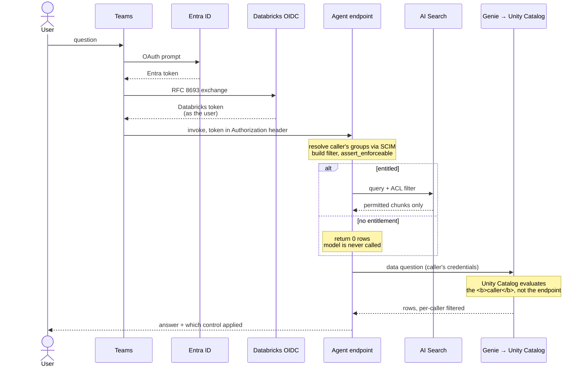

# Row-level security in een Databricks RAG-agent

*Sven Relijveld, OneDNA, september 2026*

**🇬🇧 [Read this article in English](README.md)**

---

Twee collega's stellen dezelfde chatbot dezelfde vraag. Krijgen ze hetzelfde antwoord, of horen ze
een verschillend antwoord te krijgen omdat ze verschillende dingen mogen zien? Elke organisatie die
een AI-assistent op haar eigen documenten zet, loopt hier vroeg of laat tegenaan.

In onze projecten met Databricks, zoals bij [Witteveen+Bos](https://onedna.nl/witteveenbos/), zien
we deze vragen steeds vaker langskomen. Hun business draait om het maken en verkopen van documenten,
modellen en advies aan klanten, dus produceren ze binnen een project grote hoeveelheden
ongestructureerde tekst. Maar niet iedereen hoort bij alle informatie in een project te kunnen, laat
staan bij projecten buiten zijn eigen scope.

Zo'n systeem hebben we op Databricks gebouwd: een RAG-keten over een beheerd corpus, bereikbaar
vanuit Microsoft Teams, met toegangscontrole per gebruiker. Het addertje is dat RAG op de native AI
Search (voorheen Vector Search) geen voorziening voor row-level security heeft. Een blog over het
gebruik van filters gaf ons de inspiratie om het zelf te bouwen, en hier nemen we een vereenvoudigde
versie van die aanpak om te laten zien hoe het werkt.

## AI Search voor agents: build en serve

Het platform bestaat uit twee afzonderlijke machines die toevallig een catalog delen.

De eerste is **build**. Die draait op een schema, is een batch-pipeline, en is het enige dat ooit
naar de index schrijft. Documenten komen binnen vanuit SharePoint of een fileshare waar hun
eigenaren ze publiceren, en de pipeline loodst ze door de medallion-lagen: raw geland, ingelezen in
een tabel, geparsed en gechunkt en verrijkt, en daarna gecombineerd en geëmbed tot een index. Elke
stap schrijft één beheerd Unity Catalog-artefact, en dat is wat het later inspecteerbaar maakt. De
agent zelf wordt hier ook gebouwd: de chain, de tools, de retriever en de ACL worden apart
geversioneerd en geregistreerd, en daarna als één endpoint uitgerold.

De tweede is **serve**. Dat is een live requestpad en het leest alleen maar. Een vraag komt binnen
vanuit Teams of een web-UI, de uitgerolde agent stelt vast wie het vraagt, beperkt de retrieval tot
wat die persoon mag zien, haalt op uit de index en antwoordt. Niets op dit pad schrijft iets terug.


Omdat de ACL binnen in de agent op querymoment wordt afgedwongen en niet is ingebakken in wat er
geïndexeerd wordt, bedient één uitgerolde agent elk publiek. Er is geen index per doelgroep en geen
kopie van het corpus buiten Databricks. De ruil is dat de toegangsbeslissing nu plaatsvindt in code
die jij hebt geschreven aan de serve-kant, tegen metadatakolommen die je weken eerder aan de
build-kant hebt gekozen. De twee helften hangen samen over tijd, en maar in één richting.

## Row-level security op tabellen

Neem de projectdata bij een bureau als hierboven: uren, budgetten, planning, allemaal in tabellen,
en elk projectteam mag alleen bij zijn eigen data. Die situatie handelt Unity Catalog goed af. Je
hangt een row filter en een column mask aan een tabel, en iedere lezer krijgt zijn eigen beeld
ervan. Het filter is een UDF die per query draait en kijkt naar wie de vraag stelt.

```sql
CREATE FUNCTION project_group_filter(project_group STRING)
RETURN is_account_group_member('group-water-delta') AND project_group = 'water-delta'
    OR is_account_group_member('group-projects-all');

ALTER TABLE project_hours SET ROW FILTER project_group_filter ON (project_group);
```

We wilden zeker weten dat het naar de aanroeper kijkt en niet naar de tabeleigenaar. Twee
principals draaiden dezelfde query tegen dezelfde tabel. Degene in de toegelaten groep zag alle
zeven rijen met de budgetkolom gewoon zichtbaar; degene in geen enkele toegelaten groep zag niets,
en de gemaskeerde kolom kwam als `NULL` terug op de rijen die hij elders wel kon bereiken.

Daarna hebben we het filter expres kapot gemaakt: de body vervangen door
`RETURN project_group = 'ZZ_NOWHERE'`, iedereen naar nul rijen zien zakken, het teruggezet en de
zeven zien terugkomen. Een filter dat eraan hangt, is niet per se een filter dat draait. `DESCRIBE
TABLE EXTENDED` vertelt je dát het bestaat; alleen het veranderen vertelt je dat het wérkt.

Losse filters aan elke tabel hangen schaalt niet goed, als je dataplatform duizenden tabellen
bevat. Attribute-based access control is sinds mei 2026 GA en lost dat op: je tagt de data en hangt
een policy aan een catalog of schema, waarna elk object met die tag eronder valt, inclusief
tabellen die volgende maand worden aangemaakt door iemand die nog nooit van je policy heeft
gehoord. `MATCH COLUMNS` vindt de juiste
kolom op tag in plaats van op naam, dus een tabel die hem `team_code` noemt in plaats van
`project_group` valt er nog steeds onder. Dekking hangt niet langer af van of iemand eraan denkt.

In de ABAC-documentatie staat één patroon dat we nu overal gebruiken. Tag standaard alles op
catalogniveau met `classification: unverified` en schrijf een policy die alles met die tag weigert.
Nieuwe tabellen zijn dan dicht tot iemand ze classificeert, in plaats van open tot iemand het
merkt.

Tot hier doet het platform het werk voor je. Dan richt je een RAG-pipeline op die documenten en
verandert het beeld: ABAC beschermt *tabellen*. Tag een tabel, embed de inhoud, en de index die
daaruit komt erft de grants, maar niet de policy.

## De index: waarom gaan de row filters niet mee?

Een AI Search-index ís een Unity Catalog-object en er zitten grants op: iemand mag hem bevragen of
niet. Wat er niet op zit, zijn row filters of column masks. Een index filteren is iets dat je in de
query meegeeft, als parameter, vanuit applicatiecode.

Toegangscontrole verschuift van iets dat het platform afdwingt naar iets dat jouw code
implementeert. In principe is dat even sterk: het filter draait nog steeds, en de rijen komen nog
steeds afgebakend terug. In de praktijk is het zwakker, want platformhandhaving geeft een signaal
als het misgaat en applicatiecode faalt zoals jij hem toevallig geschreven hebt.

Een document gaat op weg naar de index door parsing, chunking, verrijking en embedding, en de
security-context bereikt de index niet. Een embedding is een rij floats; welke
toegangscontrole er ook gold voor de tekst waar hij uit komt, die zit er niet in. Het enige dat
overleeft, is wat je bewust in metadatakolommen ernaast hebt weggeschreven, wat betekent dat je ACL
nooit expressiever kan zijn dan de kolommen die je bij het indexeren hebt meegenomen. Kies je dat
verkeerd, dan is de reparatie een rebuild in plaats van een grant.

Het bijbehorende probleem is dat metadata content **is**. Als je `created_by_email` of `web_url` als
ophaalbare kolom indexeert, zijn die waarden zichtbaar voor iedereen die de index mag bevragen, of
ze de chunktekst nu mogen lezen of niet. De ACL moet toeslaan vóórdat welke kolom dan ook
terugkomt, niet alleen vóór de chunktekst. Een filter dat de tekst beschermt en de auteurslijst
lekt, heeft niets beschermd.


## Filters op AI Search

Dus schrijf je het filter zelf en geef je het mee met de query. De index draagt daarvoor drie
metadatakolommen — `source_system`, `site_id` en `sensitivity` — en een query noemt de waarden die
de aanroeper mag zien. Tegen een live index van 629 chunks gaf een filter op een echte kolom met een
echte waarde drie rijen terug, en dezelfde query met een waarde die nergens op matcht nul. Het
predicaat wordt toegepast, en die tweede meting is het bewijs: een filter waarvan je weet dat het
niets mag opleveren, dat niets oplevert.

Voordat er een query de deur uit gaat, toetsen we de keys van het filter tegen de kolommen die de
index daadwerkelijk heeft:

```python
def assert_enforceable(filters: dict[str, Any]) -> None:
    """Weiger een filter dat de index niet daadwerkelijk kan toepassen."""
    unenforceable = sorted(set(filters) - set(ACL_FILTER_COLUMNS))
    if unenforceable:
        raise PermissionError(
            f"entitlement axes {unenforceable} are not columns of the index source "
            f"{list(ACL_FILTER_COLUMNS)}, so filtering on them would not be applied. "
            "Add the column to INDEX_BASE_COLUMNS (a rebuild) or stop emitting the predicate; "
            "serving unfiltered results is not an option."
        )
```

Hij gooit een error in plaats van een waarschuwing, en hij zit in de ACL-laag en niet in de
retriever zodat elke backend hem erft. pgvector wijst een onbekende kolom zelf af; AI Search niet,
en een regel die maar op één backend geldt is niet echt een regel.

> [!WARNING]
> **Een filter dat een kolom noemt die de index niet heeft, wordt genegeerd.** Het geeft geen error
> en waarschuwt niet: het houdt op met beperken. Hernoem stroomopwaarts een kolom, herbouw de index
> zonder een veld, of maak een typefout, en de query slaagt met een plausibel rijaantal en een goed
> onderbouwd antwoord. De aanroeper krijgt élk sensitivity-label in het corpus. Daarom toetst de
> guard hierboven tegen het kolomcontract in plaats van het filter te vertrouwen, en daarom is een
> filter dat niets mag opleveren het draaien waard bij elke deploy.

## Zelf de ACL bouwen: vier beslissingen

Als het platform het niet afdwingt, moet de applicatie dat doen. Dat klinkt als weinig code, en dat
is het ook: de ACL wordt per request opgelost uit het token van de aanroeper zelf, de groepen komen
uit SCIM met zijn credentials zodat niemand een lidmaatschap kan claimen dat hij niet heeft, en het
resultaat wordt expliciet meegegeven aan elke retrieval in plaats van ergens uit de omgeving te
worden opgepikt. Een veertig regels, misschien. Bijna elke regel is een beslissing over hoe je
faalt.

Vier beslissingen in die laag telden zwaarder dan het mechanisme:

- **Leeg betekent niets, niet alles.** Een aanroeper zonder gemapte groepen haalt niets op, en een
  deployment waar nog niemand de mapping heeft ingevuld serveert niets aan iedereen. Leeg is de
  default, en het is een echte default en geen placeholder.
- **Een kapotte configuratie gooit een error.** Een mapping die niet parseert stopt het request in
  plaats van uit te komen op een leeg recht, zodat de twee toestanden van elkaar te onderscheiden
  zijn op het moment dat ze optreden.
- **Een aanroeper zonder rechten bereikt het model nooit.** Hij krijgt een expliciete weigering die
  vertelt welke van zijn groepen niets verleenden, in plaats van een antwoord uit de algemene
  kennis van het model.
- **Waar rechten uit komen is een schaalbeslissing.** Een naamconventie werkt, en het is wat we bij
  Witteveen+Bos hebben opgeleverd: de groepsnaam draagt het recht, waarvoor je niets hoeft te
  configureren. Dat houdt stand zolang één groep op één ding mapt. Zodra de toegang van een
  aanroeper een combinatie van metadatakolommen is — een bronsysteem *én* een site *én* een
  gevoeligheid — moet de naam een tuple coderen, en is een gedeclareerde tabel het mechanisme dat
  overleeft. Dan verleent een niet-gemapte groep niets, en is een bronsysteem toevoegen een
  reviewbare wijziging in een configuratiewaarde.


> [!WARNING]
> Van elk van die vier bestaat een alternatief dat er in een review redelijk uitziet.
>
> **Een permissieve default** serveert het hele corpus de eerste keer dat iemand de variabele
> vergeet, en op de dag van deployen is dat niet te onderscheiden van correcte werking.
> **Een kapotte mapping die naar leeg degradeert** geeft hetzelfde symptoom als een terecht lege —
> geen rijen — en je bent een middag bezig de rechten de schuld te geven.
> **Een aanroeper zonder rechten antwoorden uit algemene kennis** levert iets op dat precies leest
> als een geslaagde retrieval.
> **Een groepsnaam los interpreteren** geeft toegang weg aan iedereen die een groep mag aanmaken:
> noem er één passend en het corpus gaat open. Gemeten tegen echte workspace-groepen maakte een
> regel die een recht uitlas uit elke groep waarvan de naam een bekend woord bevatte, van een
> beheergroep een claim op een bronsysteem. Een naamconventie is een prima mechanisme, maar het
> moet een exacte match zijn op namen die alleen jouw identiteitsproces kan uitgeven — nooit een
> substring-test.


De array-overlap-aanpak hierachter hebben wij niet bedacht. We hebben zo'n ACL per chunk eerder
gebouwd, in het Gen AI-framework dat we samen met het AI Nexus-team van
[Witteveen+Bos](https://onedna.nl/witteveenbos/) hebben opgeleverd, waar ongestructureerde
projectdocumenten vanuit SharePoint een beheerde index in stromen en elke chunk de groepen meedraagt
die hem mogen zien. Het een tweede keer bouwen is wat een verzameling losse beslissingen tot de vier
hierboven maakte.

Uit dat werk houden we ook twee gewoontes over. Merge het rechtenfilter van de aanroeper óver
eventuele door hem meegegeven filters heen en niet eronder, en verpak een meegegeven boolean in een
`and`. Anders kan een aanroeper zijn eigen ACL oprekken door een filter mee te sturen, en het happy
path ziet er in beide gevallen identiek uit. Houd het token ook in de `Authorization`-header in
plaats van in de request body, zodat niets dat payloads logt het kan vastleggen, inference tables
inbegrepen.

Dan is er nog wat je foutpaden verlenen. Een rechten-resolver moet een vraag beantwoorden die de
meeste code nooit krijgt: wat gebeurt er als we niet kunnen vaststellen wie je bent? Een 401 van
SCIM, een verlopen token, een hikje in het netwerk zijn hier allemaal routine, en elk daarvan
heeft een antwoord nodig.

```python
except Exception:
    return ["open access"]     # een routinefout verbreedt de toegang
```
```python
except Exception:
    return Entitlements.nobody(principal)   # een routinefout neemt hem weg
```

Allebei één regel en allebei zien ze er in een review redelijk uit. Bij de eerste hangt veiligheid
ervan af dat geen enkel document die sentinel-string ooit in zijn ACL-kolom draagt, en dat is een
afspraak die door niets wordt afgedwongen en die één hernoeming verwijderd is van falen. Wij falen
gesloten.

## On-behalf-of: wiens rechten gebruikt de agent?

Dat alles gaat ervan uit dat de agent weet wie het vraagt, en dat is het waard om te controleren.
De agent draait ergens — een serving endpoint, een app, een container — en dat ding heeft een eigen
identiteit. Wat je wilt, is dat de identiteit van de aanroeper Unity Catalog bereikt, en niet die
van de deployer.

On-behalf-of doet dat. Twee losse dingen bepalen of het werkt: welke host de keten draait, en hoe
het token van de aanroeper binnenkomt.

Twee hosts kunnen hem draaien, en één verschil bepaalt welke:

| | Databricks Apps | Model Serving |
| --- | --- | --- |
| Token komt binnen als | `x-forwarded-access-token`-header | in handen van de serving runtime |
| Code haalt het op via | de header lezen | `ModelServingUserCredentials()` |
| Bereikt | de breedste scope, inclusief UC Volumes | index, warehouses, tabellen, Genie — **geen** Volumes |

Zodra de keten een bestand aanraakt, moet Apps de host zijn. Schrijf de keten zo dat hij niet weet
op welke host hij draait en het blijft een configuratiewijziging.

Ze stapelen ook. Een App kan een serving endpoint als resource aanroepen en het token van de
aanroeper doorgeven, zodat het endpoint nog steeds als die gebruiker draait. Zo krijg je een UI op
Apps met de keten als model geversioneerd.

Vóór beide hosts staat wat de gebruiker opent. Teams is één front end; een web-UI of een eigen
applicatie werkt hetzelfde, want geen ervan is Databricks en geen ervan heeft een Databricks-token.
Entra-tokenfederatie is wat ze alle laat werken.

Teams geeft je nooit een Databricks-token. De OAuth-prompt van het Bot Framework geeft een
**Entra**-token terug, dat Databricks op workspace-API's weigert, dus wisselt de bot het in bij
`/oidc/v1/token` (RFC 8693) en roept het endpoint aan met het resultaat. Die exchange werkt als een
federation policy op accountniveau de issuer en audience vertrouwt, en als vier Entra-instellingen
staan: `preferred_username` als optionele access-token-claim, `requestedAccessTokenVersion` 2, een
`access_as_user`-scope en de redirect-URI van het Bot Framework.

Elke hop draagt één token, en laat de identiteit vallen als hij het niet doorgeeft:

| Hop | Draagt | Wat er gebeurt als dit niet werkt |
| --- | --- | --- |
| Gebruiker → front end | de aanmelding, via Entra | niemand is geauthenticeerd |
| Front end → Databricks | Entra-token **ingewisseld** voor een Databricks-token | de workspace-API weigert het |
| Front end → host | dat token in de `Authorization`-header | de host antwoordt als zichzelf |
| App → serving endpoint | hetzelfde token doorgegeven | het endpoint antwoordt als de App |
| Host → index, Genie, tabellen | de credentials van de aanroeper | Unity Catalog evalueert de verkeerde identiteit |

Voor de versies: `mlflow` op 2.22.1 of hoger, en `databricks-ai-bridge` aanwezig in de *gelogde*
requirements en niet alleen in de omgeving. We asserten bij registratie ook dat de index bestaat én
rijen bevat voordat er iets wordt geregistreerd, want een bundle in development-mode zet een prefix
voor het schema dat hij aanmaakt en de agent kan zich anders in `dev_<gebruiker>_schema`
registreren terwijl de gevulde index in het gedeelde schema staat.

> [!WARNING]
> Elke voorwaarde in deze paragraaf faalt zonder foutmelding.
>
> Onder `mlflow` 2.22.1 staat OBO standaard uit en antwoordt de agent als het endpoint. Ontbreekt
> `databricks-ai-bridge` in de gelogde requirements, dan laadt het model en valt het terug op zijn
> eigen identiteit. Elk van de vier Entra-instellingen breekt de token-exchange met een fout die
> iets anders noemt. En retrieval die naar het verkeerde schema wijst geeft nul rijen, wat er
> precies zo uitziet als een terecht geweigerde aanroeper.
>
> Assert op de identiteit die het antwoord heeft opgeleverd, niet op de vraag of er een antwoord
> kwam. Een test die op een response controleert, slaagt even goed of elke aanroeper nu zijn eigen
> rechten krijgt of die van de deployer.

## Testen: hoe weet je of het filter iets heeft gedaan?

Op basis van een code review is dit allemaal weinig waard, dus hebben we het gemeten. Een
gecontroleerd experiment tegen het gedeployde endpoint: dezelfde gebruiker, dezelfde vraag,
dezelfde geregistreerde modelversie, met de groep-naar-recht-mapping als enige variabele. Gemapt op de echte groep van de aanroeper gaf retrieval vijf rijen en een
onderbouwd antwoord met verwijzing naar het corpus. Gemapt op een groep waar niemand in zit, gaf
het nul rijen en een uitgelegde weigering, en werd het model nooit aangeroepen.

`obo_active` rapporteerde in beide runs `True`, en dat isoleert het rechtenfilter van de
identiteitsplumbing: de aanroeper werd in beide gevallen correct herkend en alleen zijn recht
veranderde. Zonder die vlag kan een nul "correct geweigerd" of "identiteit stuk" betekenen, zonder
manier om te zien welke van de twee.

De run met rechten leerde ons ook iets waar we niet op testten. Op de vraag wat het corpus over een
bepaald ontwerpvraagstuk besluit, antwoordde de agent dat de documenten daar geen besluit over
nemen en noemde hij de vraag onbeslist, in plaats van een besluit te verzinnen. Dat is alleen te
controleren tegen een echt corpus met echte gaten erin, want synthetische testdata beantwoordt elke
vraag die je bij het maken hebt bedacht.



De agent rapporteert welke handhaving elk antwoord heeft opgeleverd, de groepsgrant of Unity
Catalog, zodat een citatie te herleiden is tot het recht dat hem toeliet.

## Genie als tweede pad

Niet elke vraag is een documentvraag. Vraag hoeveel uren er per projectgroep zijn geboekt en een
similarity search over proza geeft passages terug, en geen enkel aantal passages telt op tot een
totaal. Daarom heeft de agent een tweede retrieval-pad, waar het platform het handhaven weer
overneemt, en kiest het model ertussen. Vragen over besluiten en onderbouwing gaan naar similarity
search over proza; vragen over aantallen en totalen gaan naar een Genie-space, die SQL genereert
tegen beheerde tabellen. Beide draaien op de credentials van de aanroeper, dus het
identiteitsverhaal is op beide
takken hetzelfde en het model kan zich geen weg banen naar een bevoorrecht pad. Wat verschilt, is
wie handhaaft. Op de prozatak is dat onze gedeclareerde grants-tabel, en herkomst betekent daar "een
van jouw groepen liet deze passage toe". Op de datatak is het Unity Catalog zelf, en herkomst
betekent "Unity Catalog heeft jou geëvalueerd", met de gegenereerde SQL en een statement-id als
bewijs.

We hebben getest of de identiteit van de aanroeper de hops naar Genie overleeft, en dat doet hij op
elk pad dat we konden bouwen. Query history schrijft het statement toe aan de mens op het
interactieve pad, via de agent onder OBO, en vanuit Teams — dat een derde hop toevoegt via Entra en
de token-exchange. In alle gevallen noemt `executed_as_user_name` de persoon, niet de service
principal van het serving endpoint.

Beide takken, en het identiteitswerk ervoor, op één pagina — lees hem eerst op randkleur, daarna
pas op pijlen:


Een service principal die dezelfde space via de API aanroept, krijgt zijn eigen identiteit
geëvalueerd, eerlijk, als zichzelf. Er worden geen rechten witgewassen. Onder user authorization
gelden de grants van de aanroeper zelf en heeft het endpoint geen eigen staande grant nodig, dus
declareert `SystemAuthPolicy` alleen het chatmodel en draagt `UserAuthPolicy` de rest.

> [!WARNING]
> Op een niet-interactief pad ís de service principal je volledige toegangscontrole. Iedere mens
> die via die integratie belt, ziet de vereniging van waar de SP recht op heeft, zonder enige
> differentiatie per aanroeper: een ruim gerechtigde SP slaat iedere aanroeper plat tot dezelfde
> toegang, correct en wel. De vraag waar een review naar moet kijken is dus waar die service
> principal toe gerechtigd is, niet of row-level security aanstaat.
>
> Er is een configuratieroute naar hetzelfde punt. Databricks documenteert dat een SP toegang geven
> tot een Genie-space ook vereist dat je de onderliggende tabellen en warehouse verleent. Volg die
> richtlijn voor een agent en het endpoint houdt een staande grant op de data, dus ziet iedere
> aanroeper de vereniging van wat het endpoint mag lezen. Onder user authorization heb je die
> grants niet nodig; voeg ze niet toe.
>
> **De lijst met gecureerde tabellen is evenmin een grens, ook al ziet ons eigen resultaat er zo
> uit.** Genie weigerde vier pogingen om een tabel buiten de lijst te bereiken en genereerde
> helemaal geen SQL. Dat is prompt-scoping — een model dat een tabel niet wil noemen die het niet
> heeft gezien — en het verandert met een modelupdate en zonder release note. De leverancier
> documenteert de tegenovergestelde garantie. Vertrouw op Unity Catalog-grants en nooit op de
> gecureerde lijst.

## Waar dit heen gaat

Twee Unity Catalog-previews mikken op het service-principalprobleem en op het schrijven van één
policy per groep. Beide zijn Beta, beide
moeten door een account-admin worden aangezet, en we hebben geen van beide in productie gedraaid.

Identity attributes laten een policy de attributen van de aanroeper rechtstreeks lezen in plaats van
via groepslidmaatschap. Account-SCIM provisioneert `title`, `department` en `costCenter` vanuit je
identity provider, en een policy kan de afdeling van de aanroeper vergelijken met een tag op de
tabel, wat één policy per afdeling terugbrengt tot één policy. De polariteit van de conditie vraagt
aandacht. De identity-functies geven `false` terug zowel als de gebruiker geen waarde voor het
attribuut heeft als wanneer de sleutel niet bestaat, dus de conditie moet zó geschreven zijn dat
`false` beperkt. Andersom geschreven ziet elke gebruiker die je SCIM-sync niet heeft gevuld de data
ongemaskeerd, en wordt een gat in je provisioning een toegangsrecht.

Context attributes mikken recht op het service-principal-probleem. Ze maken het aanvraagpad zelf
tot input voor een policy, zodat een directe query echte waarden kan geven terwijl een agent die
namens diezelfde gebruiker handelt een masker ziet. Je kunt matchen op een specifiek geregistreerde
OAuth-applicatie, waarmee "een agent mag minder zien dan de mens namens wie hij handelt"
uitdrukbaar wordt op het platform in plaats van gebouwd in de keten.

> [!NOTE]
> Beide features zijn Beta, en context attributes dekken nog niet elk pad. De documentatie is
> expliciet dat Genie `request.is_on_behalf_of` niet zet, dus de Genie-route valt buiten de policy.
> Een personal access token zet hem ook niet, en de ingebouwde `databricks-cli` client-id is
> gedeeld, dus een agent die hem gebruikt is niet te onderscheiden van een mens achter een
> terminal. Registreer je eigen OAuth-applicatie als je een specifieke wilt governen.
>
> Let bij identity attributes op de polariteit van de conditie. De functies geven `false` terug
> zowel als de gebruiker geen waarde heeft als wanneer de sleutel niet bestaat, dus schrijf de
> conditie zó dat `false` beperkt. Andersom ziet elke gebruiker die je SCIM-sync niet heeft gevuld
> de data ongemaskeerd.

Er is een derde optie, en die is vandaag al beschikbaar in plaats van Beta: serveer de vectoren uit
pgvector op Lakebase in plaats van uit AI Search. De ACL wordt dan weer een row-level
security-policy die de database evalueert, waarmee de handhaving terugkomt aan de platformkant van
de grens die dit artikel steeds trekt. Voor ons is dat een governance-argument en geen
latency-argument.

Diezelfde klasse fouten verdwijnt er niet mee. Ons `sensitivity`-filter noemde een kolom die geen
enkele stap ooit produceerde: op AI Search wordt dat genegeerd, en een aanroeper die tot `internal`
beperkt was kreeg stilletjes `confidential`-rijen. Op pgvector is hetzelfde filter een harde "kolom
bestaat niet" — dat geeft een signaal, en is even kapot. Een regel die alleen standhoudt op de
backend die een signaal geeft, is geen regel. Wat verandert, is dat je het merkt.

## Wat ik een team dat hieraan begint zou meegeven

Weet aan welke kant van de grens je staat. Een beheerde tabel wordt door het platform afgedwongen en
een vectorindex door jou, en die twee verdienen niet hetzelfde vertrouwen. Ga ervan uit dat elke
fout stil is, want in deze stack zijn de meeste dat, en ontwerp op wat je kunt waarnemen in plaats
van op wat het mechanisme belooft. Faal gesloten, en zorg dat "geen recht" en "er ging iets stuk" er
van buiten niet hetzelfde uitzien. Review op elk niet-interactief pad waar de service principal toe
gerechtigd is.

Welk pad je krijgt volgt uit twee vragen — of de content gestructureerd is, en of je ACL past op de
kolommen die je mee de index in kunt nemen:


Verifieer daarna door te breken. Richt het filter op iets dat niets mag opleveren en kijk of het
niets oplevert. Trek de grant in en kijk of het antwoord verdwijnt. Zet de groep op eentje waar
niemand in zit en controleer of het rijaantal naar nul gaat. Zolang je een control niet expres hebt
zien falen, heb je hem niet zien werken.

Voor mij is de eerlijke samenvatting dat de mechanismen het makkelijke deel waren. Unity Catalog
evalueert per aanroeper, OBO propageert door drie hops inclusief Teams, filters worden toegepast, en
dat hebben we allemaal gemeten. De moeilijkheid zat nooit in ze aan de praat krijgen. Die zat in
genoeg instrumentatie bouwen om te weten wanneer ze ermee waren gestopt.

## Zelf proberen

De map [`examples/`](../examples/) bevat uitvoerbare demonstraties van elke fout die hierboven staat,
en [`diagrams/`](../diagrams/) bevat de architectuur als bewerkbare draw.io-bronbestanden.

| Voorbeeld | Toont |
| --- | --- |
| [`01_index_has_no_rls.py`](../examples/01_index_has_no_rls.py) | het stille wegvallen: filter op een kolom die de index niet heeft |
| [`02_assert_enforceable.py`](../examples/02_assert_enforceable.py) | de guard, en de test die vangt wat hij voorkomt |
| [`03_acl_from_groups.py`](../examples/03_acl_from_groups.py) | SCIM-groepen naar rechten, fail-closed |
| [`04_obo_three_ways.py`](../examples/04_obo_three_ways.py) | de drie credential providers naast elkaar |
| [`05_genie_per_caller.py`](../examples/05_genie_per_caller.py) | het contrast met de beheerde tabel |
| [`sql/row_filter_fixture.sql`](../examples/sql/row_filter_fixture.sql) | een reproduceerbare RLS-fixture die zichzelf expres breekt |

## Tot slot

Row-level security over een RAG-agent is geen feature die je aanzet. Het is een reeks kleine
beslissingen over hoe je faalt, genomen weken uit elkaar aan weerszijden van de index, en de meeste
ervan zien er in een review redelijk uit. Unity Catalog doet zijn deel per aanroeper en OBO draagt
de identiteit door drie hops heen; de rest is van jou. Bouw daarom niet alleen de control, maar ook
het bewijs dat hij nog draait.

## Benieuwd hoe andere teams toegangscontrole op AI-toepassingen aanpakken?

We gaan graag in gesprek over ervaringen, best practices en lessen uit de praktijk van RAG, Unity
Catalog en per-gebruiker toegangscontrole op Databricks. Neem contact op via
[onedna.nl](https://onedna.nl) of [LinkedIn](https://nl.linkedin.com/company/one-dna).

---

<sub>Geschreven door Sven Relijveld bij [OneDNA](https://onedna.nl). Kennisdelen zit in ons DNA.
Gemeten in een Databricks-sandbox in augustus en september 2026; identifiers en groepsnamen zijn
voor publicatie gegeneraliseerd.</sub>
