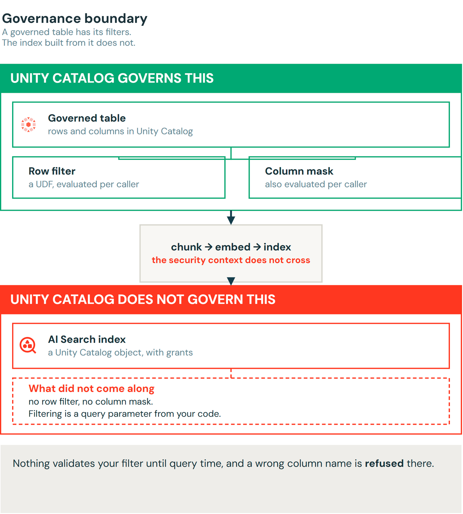
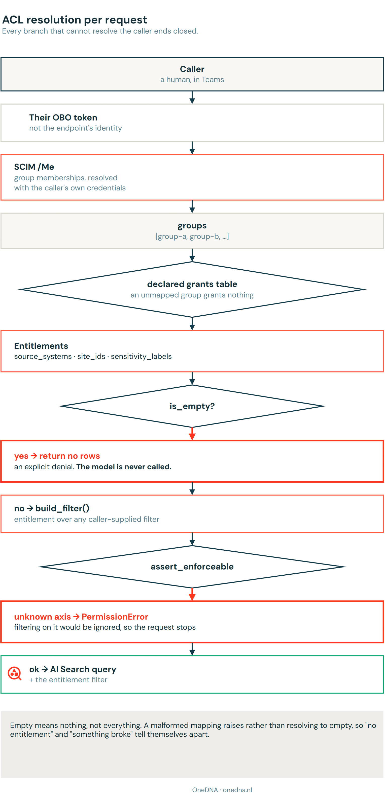
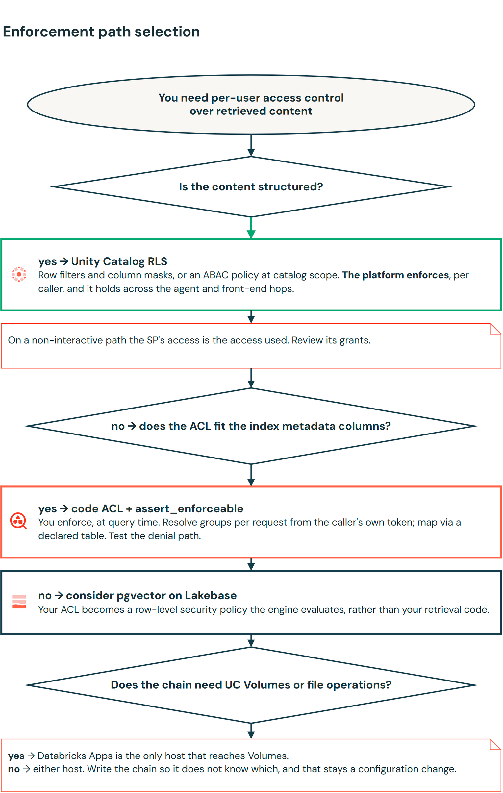

# Row-level security for a RAG agent: what Unity Catalog enforces, and what you have to build

*A OneDNA contribution. Written by Sven Relijveld, reviewed internally before submission.*

---

Two colleagues ask the same chatbot the same question. Should they get the same answer, or different ones because they are allowed to see different things? Every organisation that puts an AI assistant on top of its own documents runs into this sooner or later.

Unity Catalog has a good implementation for that on calls to tables. Attach a row filter and a column mask, and every reader gets their own view of the same object, evaluated against whoever is asking. It does not have a type of grant for row filters *inside* a vector index. An AI Search index is a Unity Catalog object with object-level grants, so you can allow or deny querying it, but it has no row filters and no column masks. Filtering an index is a parameter you pass in the query, from your own application code.

Databricks documents this.

> "Row and column level permissions are not supported. However, you can implement your own application level ACLs using the filter API."
> — [Databricks AI Search documentation](https://docs.databricks.com/aws/en/vector-search/vector-search)

This post is about the implementation of this, and the caveats. We built per-user access control over a governed corpus at a civil engineering consultancy, reachable from applications outside Databricks. In that project, it was reached from a Custom WebUI, but we use Microsoft Teams for this demo. What follows is the design, the code, and the parts that
surprised us.

The starting point was [Mastering RAG Chatbot Security: ACL and Metadata Filtering with Mosaic AI Vector Search](https://community.databricks.com/t5/technical-blog/mastering-rag-chatbot-security-acl-and-metadata-filtering-with/ba-p/101946),
which tags chunks with a metadata column and passes a matching value as a query filter. That post passes the value in by hand. Resolving it from the caller is the part we had to add.

## What Unity Catalog does for RLS on tables

Unity Catalog has four mechanisms for access on a governed table, and it helps to know which question each answers:

| Mechanism | The question it answers |
| --- | --- |
| Object privileges | may you touch this table at all? |
| ABAC policy | which rule applies, by tag, across the whole catalog or schema? |
| Row filter | which rows come back for you? |
| Column mask | which values in them are readable by you? |

A row filter is a UDF that runs per query and resolves against the caller:

```sql
CREATE FUNCTION project_group_filter(project_group STRING)
RETURN is_account_group_member('group-water-delta') AND project_group = 'water-delta'
    OR is_account_group_member('group-projects-all');

ALTER TABLE project_hours SET ROW FILTER project_group_filter ON (project_group);
```

It resolves against the caller and not the table owner, and you can test it by replacing the body with `RETURN project_group = 'NON_EXISTING_GROUP'` — a group no row has, so a working filter has to return nothing to everybody.

That is important. A filter that is attached is not necessarily a filter that runs. `DESCRIBE TABLE EXTENDED` tells you it exists; changing it and watching the results verifies that it works.

Attribute-based access control went GA in April 2026 and scales this past table-by-table maintenance: tag the data, attach a policy to a catalog or schema, and every object with that tag is covered, including tables created next month by another person.
`MATCH COLUMNS` finds the right column by tag rather than by name, so a table that spells it `team_code` instead of `project_group` is still covered.

One ABAC pattern you can use for additional security: Tag everything `classification: unverified` by default at the catalog level, then write a policy that refuses anything still tagged that way. New tables are then closed until somebody classifies them, rather than open until somebody notices. The beta functionality of tag propagation and auto-tagging will help you implement this quickly.

## AI Search does not have native RLS capabilities

Point an AI Search index at those governed tables and the picture changes. ABAC governs *tables*. Tag a table, embed its contents, and the index that results can take the grants but not the row-level security. You need to explicitly add metadata columns to filter on to the source table, and add filters to the query being sent to the index.



A document travels through parsing, chunking, enrichment and embedding on its way to the index, and the security context does not reach the index. What arrives is what you deliberately wrote into metadata columns alongside it, which means your ACL can never be more expressive than the columns you wrote at index time. Because a schema change, leads to recreating the table, you might spend a lot of tokens on reindexing your entire corpus. Those columns are a build-side prerequisite, not a retrieval concern: their values usually come from the source system, so the pipeline has to reach them before the serve side can filter on anything.

We pulled SharePoint metadata over the Graph API as a separate step and joined it onto the chunks later. The Databricks SharePoint connector now exposes `_sharepoint_metadata` directly, which removes that join — it needs DBR 18 LTS, and on older versions, the read still succeeds with every metadata field absent.

A second caveat: metadata **is** content. If you index `created_by_email` or `web_url` as a retrievable column, those values are visible to anyone who can query the index, whether or not they can read the chunk text. The ACL has to apply before any column comes back, not just before the chunk body does.

> [!WARNING]
> **A filter naming a column the index does not have is ignored.** No error, no warning — it stops constraining, and the query still returns a plausible row count and a well-sourced answer.
> Rename a column upstream, rebuild without a field, or typo it, and the caller receives every sensitivity label in the corpus.

> [!NOTE]
> **Update, September 2026.** Re-running the probe against a fresh index, AI Search now *rejects* an unknown filter column — `BadRequest: Columns referenced in filters are not present in index: sensitivty` — rather than ignoring it. The control probes were unchanged (three rows unfiltered, two on a real column, zero on a real column with no matching value), so filtering was live and this is the platform validating filter keys against the index contract. Measured on one AWS workspace, `STANDARD` endpoint, `HYBRID` index subtype; I have not established whether it holds everywhere.
>
> This is better behaviour, and it arrived without a release note. Keep the assertion below anyway: the behaviour moved once and can move again; a column that exists in the source but was never synced into the index is a different and likelier mistake; and a refusal at query time is a 500 to your caller, where the assertion is a clean `PermissionError` before the request leaves. If you have measured different behaviour on your own endpoint type or cloud, I would like to hear about it.

That last one is why we assert every filter's keys against the columns the index actually has, before the query goes out, and raise rather than warn:

```python
def assert_enforceable(filters: dict[str, Any]) -> None:
    unenforceable = sorted(set(filters) - set(ACL_FILTER_COLUMNS))
    if unenforceable:
        raise PermissionError(
            f"entitlement axes {unenforceable} are not columns of the index source "
            f"{list(ACL_FILTER_COLUMNS)}, so filtering on them would be ignored without an error."
        )
```

It lives in the ACL layer rather than the retriever, so every backend inherits it. pgvector would
reject an unknown column on its own; AI Search will not, and a rule that only holds on one backend
is not much of a rule.

## Resolving the caller

The filter value has to come from the person asking. That means one call, with the caller's own
token in the header:

```python
def groups_for(token: str) -> list[str]:
    # Ask Databricks who the caller is, as the caller.
    req = urllib.request.Request(
        f"{WORKSPACE}/api/2.0/preview/scim/v2/Me",
        headers={"Authorization": f"Bearer {token}"},
    )
    with urllib.request.urlopen(req, timeout=30) as resp:
        body = json.loads(resp.read())
    return [g["display"] for g in body.get("groups", [])]
```

We use the caller's token rather than the endpoint's, so nobody can claim a membership they do not have, because they are not the one answering the question.

> [!NOTE]
> `/Me` returns direct memberships. A workspace-local group can have an Entra-sourced group as a member, so somebody can be a transitive member of a group this call does not list, and removing them from the outer group does not demote them.



There are four design questions implemented in that flow:

- **Empty means nothing, not everything.** A caller with no mapped groups retrieves nothing, and a
  deployment where nobody configured the mapping serves nothing to everybody.
- **A malformed configuration raises.** A mapping that will not parse stops the request rather than resolving to empty, so the two states are told apart.
- **An unentitled caller never reaches the call to the index.** They get an explicit denial, rather than an answer assembled from the model's general knowledge.
- **Where entitlements come from is a scale decision.** A naming convention works and needs no
  configuration at all. Once a caller's access is a combination of columns — e.g. a source system *and* a site *and* a sensitivity — the name has to encode a tuple, and a declared table is needed.

Each has an alternative that grants access instead of refusing it, and each alternative is one line. A 401 from SCIM is a routine event — an expired token — so what your error path returns decides what a routine failure grants. Measured against real workspace group names, a rule that read an entitlement out of any group whose name contained a known token turned an administration group into
a claim on a source system.

## Making sure the agent knows who is asking

All of that assumes the caller's identity reaches Unity Catalog rather than the deployer's. On-behalf-of Authentication does that, and two things decide whether it works: which host runs the chain, and how the token gets in.

| | Databricks Apps | Model Serving |
| --- | --- | --- |
| Token arrives as | `x-forwarded-access-token` header | held by the serving runtime |
| Code obtains it via | read the header | `ModelServingUserCredentials()` |
| Reaches | the widest scope, including UC Volumes | index, warehouses, tables, Genie — **not** Volumes |

The moment the chain touches a file, Apps has to be the host. Write the chain so it does not know
which host it is on and that stays a configuration change.

Teams never yields a Databricks token. The Bot Framework OAuth prompt returns an **Entra** token, which Databricks rejects on workspace APIs, so the bot exchanges it at `/oidc/v1/token` (RFC 8693) and calls the endpoint with the result. That exchange needs an account-level federation policy trusting the issuer and audience, plus four Entra settings: `preferred_username` as an optional access-token claim, `requestedAccessTokenVersion` 2, an `access_as_user` scope, and the Bot Framework redirect URI.

> [!WARNING]
> Below `mlflow` 2.22.1 OBO is off by default and the agent answers as the endpoint. A missing `databricks-ai-bridge` in the requirements drops the agent back to its own identity.

To test, you need to assert on the identity that produced the answer, not on whether an answer arrived. A test that checks for a response passes identically whether every caller is being served their own permissions or the deployer's.

## The results

Two colleagues, two projects, the same agent and the same two questions. Alice is on project Water Delta; David is on Coastal North. Neither is an administrator and neither is locked out — David simply holds a grant on other data, which is the ordinary case.


Ask *how many hours did we book on Water Delta in Q2* and the question is quantitative, so it routes to Genie and a SQL warehouse. Alice gets 1,240 hours across eight entries. David gets an empty result, because Unity Catalog evaluated the row filter against his identity and the hours table holds no Water Delta rows he can read.

Ask *what went wrong on Water Delta, and what did we learn* and the question is qualitative, so it routes to the AI Search index. Alice gets six chunks and an answer citing the retrospective and the closeout note. David gets nothing, because our code passed `{"project_group": "coastal-north"}` and no chunk has that group attached.

Both of David's answers are empty, and while the answers look identical, they are slightly different in mechanism. On the Genie path the platform decided, and it would have decided the same way for any caller on any client. On the AI Search path *our filter* decided — and had we passed no filter, or one naming a
column the index does not have, he would have received Water Delta chunks with no error and no warning.

`obo_active` reads `true` in all four metadata boxes, which is what makes either zero readable.
Without it a zero could mean "correctly filtered" or "identity broken", and the two are
indistinguishable from the answer alone. The same holds across hops: query history attributes the
statement to the human on the interactive path, through the agent under OBO, and from Teams, which
adds a third hop through Entra and the token exchange. In each case `executed_as_user_name` names
the person, not the endpoint's service principal.

## Two things that surprised us

**The curated table list is not a boundary, even though our own result looks like one.** Genie
refused four attempts to reach an off-list table and generated no SQL at all. That is prompt scoping
— a model declining to name a table it has not been shown — and it will change with a model update
and no release note. Rely on Unity Catalog grants.

**A documented configuration path overrules on-behalf-of and takes the SP identity.** Granting a
service principal access to a Genie space also requires granting its underlying tables and
warehouse. Follow that for an agent and
the endpoint holds a standing grant on the data, so every caller sees the union of what the endpoint
may read. Under user authorisation you do not need those grants. `SystemAuthPolicy` should declare
only the chat model; `UserAuthPolicy` handles the rest.

More generally, on any non-interactive path the service principal is the whole of your access
control. Every human calling through that integration sees the union of what it was granted, with no
differentiation. The platform is behaving correctly and reporting the identity it was given, which
means the review question is what the service principal is granted, whatever row-level security is
switched on.

## What we would tell a team starting this

**Know which side of the boundary you are on.** A governed table is enforced by the platform and a
vector index is enforced by you, and those deserve different amounts of confidence.

**Write the columns at index time.** Your ACL can never be more expressive than the metadata you
put alongside the chunks, and adding one later means a rebuild.

**Deny on error.** Make "no entitlement" and "something broke" tell themselves apart, so a zero row
count is diagnosable.

**Check the service principal, not the feature.** On any non-interactive path the SP is the whole of
your access control.

Which path you land on follows from two questions — whether the content is structured, and whether
your ACL fits the columns you can get into the index:



Then test each control against a case where it has to deny. Point the filter at a value no row
has and check it returns nothing. Revoke the grant and check the answer disappears. Set the
group to one nobody is in and check the row count goes to zero. A control you have only seen succeed
is a control you have not tested.

One option we have not run in production is worth naming: serving the vectors from pgvector on
Lakebase instead of AI Search. The ACL then goes back to being a row-level security policy the
database evaluates, which puts enforcement on the platform side of the boundary this post has been
drawing. It does not come free of the same class of mistake — our `sensitivity` filter once named a
column no stage produced, and on pgvector that is a hard "column does not exist" rather than a
silent pass. Equally broken, but you find out.

---

*Written by Sven Relijveld at [OneDNA](https://onedna.nl), a Databricks partner in the Netherlands.
Measured in a Databricks sandbox during August and September 2026; identifiers, group names and
project data are generalised for publication. The runnable examples, including a Unity Catalog RLS
fixture with its negative tests, are in the
[companion repository](https://github.com/OneDNA/blog-databricks-rag-rls).*
