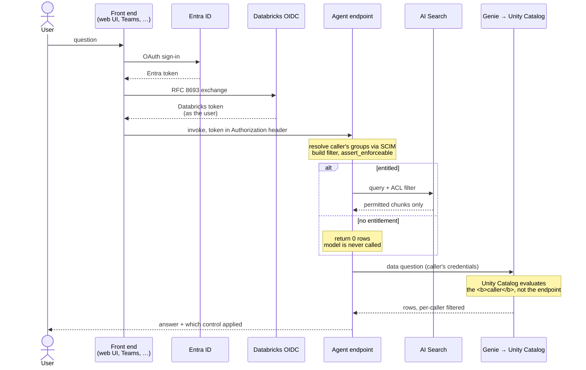

# Row-level security in a Databricks RAG agent

*Sven Relijveld, OneDNA, september 2026*

**🇳🇱 [Lees dit artikel in het Nederlands](row-level-security.nl.md)**

---

Two colleagues ask the same chatbot the same question. Do they get the same answer, or should they
get different ones because they are allowed to see different things? Every organisation that puts
an AI assistant on top of its own documents runs into this sooner or later.

In our projects with Databricks, like at [Witteveen+Bos](https://onedna.nl/witteveenbos/), we see
these questions lining up more frequently. Their business revolves around creating and selling
advice reports, models and papers to their clients, so they generate large amounts of unstructured
text in the context of a project. But not everyone should have access to all information in a
project, let alone to projects outside their access level.

We built such a system on Databricks: a RAG chain over a governed corpus, reachable from
applications outside Databricks — a custom web interface like OpenWebUI, or a client such as
Microsoft Teams, once Entra token federation is enabled — with access control per user. RAG on the
native AI Search (formerly Vector Search) has no feature for row-level security, so we built it
ourselves. The starting point was [Mastering RAG Chatbot Security: ACL and Metadata Filtering with
Mosaic AI Vector
Search](https://community.databricks.com/t5/technical-blog/mastering-rag-chatbot-security-acl-and-metadata-filtering-with/ba-p/101946),
which tags chunks with a metadata column and passes a matching value as a query filter. That post
passes the value in by hand; the piece we had to add was resolving it from the caller, which is
where SCIM comes in. Here we take a simplified version of that approach to show how it works.

## AI RAG agent and index development

The AI RAG system consists of two parts: a build part, where data is prepared and agents are
developed, and a serve part, where agents and indexes are deployed and called.

The first is the **build** path. It runs on a schedule and it is a batch pipeline. Documents arrive
from SharePoint or a fileshare where their owners publish them, and the pipeline walks them through
the medallion layers: landed raw, ingested to a table, parsed and chunked and enriched, then
combined and embedded into an index. Each stage writes one governed Unity Catalog artefact, so you
can inspect every step later. The agent is built here too: the chain, its tools, the retriever and
the ACL are each versioned and registered, then deployed as one endpoint.

The second is the **serve** path. It is a live request path and it reads the index at inference
time. A question arrives from a web UI or another external client, the deployed agent resolves who
is asking, narrows retrieval to what that person may see, fetches from the index, and answers.


We want to enforce permissions at query time, inside the agent, rather than baking them into what
gets indexed. This means you do not need separate indexes for different audiences: one deployed
agent serves every audience, and no copy of the corpus sits outside Databricks. The trade is that
the access decision now happens in code you wrote on the serve side, against metadata columns you
chose on the build side.

## Row-level security on tables
On regular tables, we can implement row-level security easily.
Take the project data at a firm like the one above: hours, budgets, planning, all in tables, and
each project team allowed to see only its own. Unity Catalog handles that case well. You attach a
row filter and a column mask to a table, and every reader gets their own view of it. The filter is
a UDF that runs per query and resolves against whoever is asking.

```sql
CREATE FUNCTION project_group_filter(project_group STRING)
RETURN is_account_group_member('group-water-delta') AND project_group = 'water-delta'
    OR is_account_group_member('group-projects-all');

ALTER TABLE project_hours SET ROW FILTER project_group_filter ON (project_group);
```

It resolves against the caller and not the table owner. Two principals running the same query
against the same table see different results: the one in the admitted group gets all seven rows
with the budget column in the clear, and the one in no admitted group gets nothing, with the masked
column coming back as `NULL` on rows it can reach elsewhere.

You can check the filter actually runs by replacing its body with
`RETURN project_group = 'NON_EXISTING_GROUP'`, a group no row has, so a working filter returns
nothing to everybody. Restoring the original brings the seven back. A filter that is attached is
not necessarily a filter that runs: `DESCRIBE TABLE EXTENDED` tells you it exists, changing it
tells you it works.

Individual filters attached to every table do not scale well if your data platform contains
thousands of tables. Attribute-based access control went generally available in April 2026 and fixes
that: you tag the data and attach a policy to a catalog or a schema, and every object with that
tag is covered, including tables created next month by somebody who does not know the policy exists.
`MATCH COLUMNS` finds the right column by tag rather than by name, so a table that spells it
`team_code` instead of `project_group` is still covered. Coverage stops depending on anybody
remembering.

Four mechanisms stack on a governed table, and it helps to know which question each one answers:

| Mechanism | The question it answers |
| --- | --- |
| Object privileges | may you touch this table at all? |
| ABAC policy | which rule applies, by tag, across the whole catalog? |
| Row filter | which rows come back for you? |
| Column mask | which values in them are readable by you? |

The ABAC documentation has one pattern we now use everywhere. Tag everything
`classification: unverified` by default at the catalog level, then write a policy that refuses
anything still tagged that way. New tables are closed until somebody classifies them, rather
than open until somebody notices. The beta functionality of tag propagation and auto-tagging will
help you implement this quickly.

So far the platform is doing the work for you. Then you point a RAG pipeline at those documents,
and the picture changes: ABAC governs *tables*. Tag a table, embed its contents, and the index that
results can take the grants but not the row-level security. You need to explicitly add metadata
columns to filter on to the source table, and add filters to the query being sent to the index.

## The index does not inherit the filters

An AI Search index is a Unity Catalog object with grants, so you can allow or deny querying it. It
has no row filters and no column masks. Filtering an index is a parameter you pass in the query,
from application code.

Access control moves from something the platform enforces to something your code implements. In
principle that is just as strong: the filter still runs, and the rows still come back scoped. In
practice it is weaker, because platform enforcement gives notice when it goes wrong and
application code fails however you happened to write it.

A document travels through parsing, chunking, enrichment and embedding on its way to the index, and
the security context does not reach the index. What arrives is what you deliberately wrote into
metadata columns alongside it, which means your ACL can never be more expressive than the columns
you wrote at index time. Because a schema change leads to recreating the table, you might spend a
lot of tokens on reindexing your entire corpus.

The related problem is that metadata **is** content. If you index `created_by_email` or `web_url`
as a retrievable column, those values are visible to anyone who can query the index, whether or not they
can read the chunk text. The ACL has to apply before any column comes back, not just before the
chunk body does. A filter that protects the text and leaks the author list has not protected
anything.


## Filters on AI Search

So you write the filter yourself and pass it with the query. In our example the index has three
metadata columns for this — `source_system`, `site_id` and `sensitivity` — and a query names the
values the caller is allowed to see. Those three columns exist because the access requirement
needed them, and you pick them at index time.

That makes them a pipeline prerequisite. The values usually come from the source system, so the
build side has to reach them before the serve side can filter on anything. At Witteveen+Bos we
pulled the SharePoint metadata over the Graph API as a separate step and joined it onto the chunks
later. The Databricks SharePoint connector now exposes `_sharepoint_metadata` directly, which
removes that join. It needs DBR 18 LTS, and on older versions the read still succeeds with every
metadata field absent.

Against a live index, a filter naming a real column and a real value returned rows, and the same
query with a value that matches nothing returned zero. The second query is the one that proves the
predicate applies.

Before any query goes out, we assert the filter's keys against the columns the index actually has:

```python
def assert_enforceable(filters: dict[str, Any]) -> None:
    """Refuse to hand back a filter the index cannot actually apply."""
    unenforceable = sorted(set(filters) - set(ACL_FILTER_COLUMNS))
    if unenforceable:
        raise PermissionError(
            f"entitlement axes {unenforceable} are not columns of the index source "
            f"{list(ACL_FILTER_COLUMNS)}, so filtering on them would not be applied. "
            "Add the column to INDEX_BASE_COLUMNS (a rebuild) or stop emitting the predicate; "
            "serving unfiltered results is not an option."
        )
```

It raises rather than warns, and it lives in the ACL layer rather than the retriever so every
backend inherits it. Both backends reject an unknown column on their own today, but a rule that
only holds on one backend, or on one month's behaviour, is not much of a rule.

> [!WARNING]
> **A filter naming a column the index does not have refuses the query.** A typo'd column comes
> back as a hard error:
>
> ```
> BadRequest: Columns referenced in filters are not present in index: sensitivty
> ```
>
> The predicate is refused rather than dropped: the platform validates filter keys against the
> index contract, which is the job the guard above does by hand. To check what your own index does,
> query it with a filter naming a column that does not exist and see whether you get rows, zero rows
> or an error.

## Building the ACL: four decisions

If the platform will not enforce it, the application must. That sounds like a small amount of
code, and it is: the ACL resolves per request from the caller's own token, the groups come from
SCIM using their credentials so nobody can claim a membership they do not have, and the result is
passed explicitly into every retrieval rather than read from somewhere else. Perhaps forty
lines.

The groups come from one call, with the caller's own token in the header:

```python
def groups_for(token: str) -> list[str]:
    """Ask Databricks who the caller is, as the caller."""
    req = urllib.request.Request(
        f"{WORKSPACE}/api/2.0/preview/scim/v2/Me",
        headers={"Authorization": f"Bearer {token}"},
    )
    with urllib.request.urlopen(req, timeout=30) as resp:
        body = json.loads(resp.read())
    return [g["display"] for g in body.get("groups", [])]
```

We use the caller's token rather than the endpoint's, so nobody can claim a membership they do not
have, because they are not the one answering the question. A 401 here is a
routine event — an expired token — so what this function does on failure decides what an error
grants. We return nothing.

> [!NOTE]
> `/Me` returns direct memberships. A workspace-local group can have an Entra-sourced group as a
> member, so somebody can be a transitive member of a group this call does not list, and removing
> them from the outer group does not demote them.

Four decisions in that layer shaped the rest:

- **Empty means nothing, not everything.** A caller with no mapped groups retrieves nothing, and a
  deployment where nobody has configured the mapping yet serves nothing to everybody. Empty is the
  default, and it is a real default rather than a placeholder.
- **A malformed configuration raises.** A mapping that will not parse stops the request rather than
  resolving to an empty entitlement, so the two states are told apart at the point they occur.
- **An unentitled caller never reaches the call to the index.** They get an explicit denial naming
  which of their groups granted nothing, rather than an answer assembled from the model's general
  knowledge.
- **Where entitlements come from is a scale decision.** A naming convention works, and it is what
  we shipped at Witteveen+Bos: the group's name holds the entitlement, which needs no
  configuration at all. It holds as long as one group maps to one thing. Once a caller's access is
  a combination of metadata columns — e.g. a source system *and* a site *and* a sensitivity — the
  name has to encode a tuple, and a declared table is needed. Then an unmapped
  group grants nothing, and adding a source system is a reviewable change to a config value.


> [!WARNING]
> Each of those four has an alternative that grants access instead of refusing it.
>
> - **A permissive default** serves the whole corpus the first time somebody forgets the variable.
> - **A malformed mapping degrading to empty** has the same symptom as a correctly empty one.
> - **Answering from general knowledge** reads exactly like a successful retrieval.
> - **Parsing a group's name loosely** hands access to anyone who can create a group.

That last one is not hypothetical. Against real workspace groups, a rule that read an entitlement
out of any group whose name contained a known token turned an administration group into a claim on
a source system. A naming convention is a fine mechanism, but it has to be an exact match
against names only your identity process can mint — never a substring test.

We did not invent the array-overlap approach behind this. We built a per-chunk ACL like it before,
in the Gen AI framework we delivered with the AI Nexus team at
[Witteveen+Bos](https://onedna.nl/witteveenbos/), where unstructured project documents flow from
SharePoint into a governed index and every chunk lists the groups allowed to see it. Building it
a second time is what turned a set of scattered decisions into the four above.

That work also left us with two habits. Merge the caller's entitlement filter over any
caller-supplied filters rather than under them, and wrap a caller-supplied boolean in an `and`.
Otherwise a caller can widen their own ACL by passing a filter, and the happy path looks identical
either way. Keep the token in the `Authorization` header rather than the request body too, so
nothing that logs payloads can capture it, inference tables included.

Then there is what your error paths grant. An entitlement resolver has to answer a question most
code is never asked: what happens when we cannot determine who you are? A 401 from SCIM, an
expired token, a network blip are all routine events here, and each one needs an answer.

```python
except Exception:
    return ["open access"]     # a routine error widens access
```
```python
except Exception:
    return Entitlements.nobody(principal)   # a routine error removes it
```

Both are one line and neither would stop a reviewer. The first makes safety depend on no
document ever holding that sentinel string in its ACL column, which is a convention enforced by
nothing and one rename away from failing. We deny instead.

### Should the ACL be a Unity Catalog function?

If Unity Catalog is the thing that governs, the obvious question is whether this logic belongs
inside it as a registered function rather than in the agent's Python. It turns out not to be
possible.

A Python UDF registered in Unity Catalog cannot make outbound network requests. On a serverless SQL
warehouse the documentation is explicit that a query attempting one **hangs indefinitely** rather
than failing. Our ACL resolves group membership over SCIM, so the identity half cannot move into a
function at all without a preview networking feature, a batch UDF and a service credential. A
request that hangs forever is a worse failure than one that raises.

The filter-building half could move, and still should not. A Unity Catalog function is not enforced
by the index: the agent has to call it and then apply the result itself, exactly as it does now, so
you buy indirection rather than enforcement — and pay a round-trip per request, harder unit tests,
and a function version to keep in step with an agent version. Databricks documents the application
route as the intended one: row and column level permissions are not supported on an index, and you
implement your own application-level ACL using the filter API.

> [!WARNING]
> **`is_account_group_member()` in a function body may not evaluate the person you think.**
> Statements there run with the **owner's** privileges and the function resolves the **session**
> user, so on any path falling back to the endpoint's credentials it becomes the service principal.

The documentation does not describe that function's behaviour under model serving on-behalf-of at
all, so we treat caller resolution there as unverified rather than guaranteed. The same reasoning
rules out exposing the ACL as an agent tool: a tool is something the model chooses to call, and this
has to run on every request, before retrieval, whether the model would have picked it or not.

### Is the entitlement mapping its own governed table?

The four decisions above put entitlements in a declared mapping, and in our build that mapping is a
configuration value — which is why "adding a source system is a reviewable change" means a pull
request. A Unity Catalog table is the better home for it, with one condition that decides the whole
design.

As a table it gains what a config value cannot have: `MODIFY` granted separately from the
deployment path, Delta history answering who changed an entitlement and when, lineage, and audit
events in `system.access.audit`. Authorisation data is exactly the kind of data you later have to
answer questions about.

The condition is which identity reads it. Read the mapping under the caller's own token and the
caller needs `SELECT` on it — so any user can read every group's entitlements, which is a
disclosure about the security model itself and strictly worse than the config value it replaced. So
the request path uses two identities deliberately: the caller's token resolves the caller's own
group membership, and the endpoint's service principal reads the mapping. Cache it in process with
a bounded refresh, and define what happens when the read fails, because the ACL now depends on a
data path being up before it can authorise anything. Deny there too.

> [!NOTE]
> Do not reach for a row filter on the mapping table to solve the disclosure problem. Time travel
> and cloning fail on a table with an active ABAC policy, so you would spend the audit history that
> motivated the table in the first place.
>
> This one is a design conclusion rather than a measurement. Everything else here we ran; the
> mapping in our build is still the config value.

## On-behalf-of: which identity reaches Unity Catalog

All of that assumes the agent knows who is asking, which is worth checking. The agent runs
somewhere — a serving endpoint, an app, a container — and that thing has an identity of its own.
What you want is the caller's identity reaching Unity Catalog, not the deployer's.

On-behalf-of does that. Two separate things decide whether it works: which host runs the chain,
and how the caller's token gets in.

Two hosts can run it, and one difference settles which:

| | Databricks Apps | Model Serving |
| --- | --- | --- |
| Token arrives as | `x-forwarded-access-token` header | held by the serving runtime |
| Code obtains it via | read the header | `ModelServingUserCredentials()` |
| Reaches | the widest scope set, including UC Volumes | index, warehouses, tables, Genie — **not** Volumes |

The moment the chain touches a file, Apps has to be the host. Write the chain so it does not know
which host it is on and that stays a configuration change.

They also stack. An App can call a serving endpoint as a resource and forward the caller's token,
so the endpoint still runs as the user. That gives you a UI on Apps with the chain versioned as a
model.

In front of either host sits whatever the user opens: a custom web UI, something like Microsoft
Teams, any client that is not Databricks. None of them can hold a Databricks token, so they all
need the same thing — **Entra token federation**.

Signing the user in with Entra gets you an Entra token, which Databricks rejects on workspace
APIs. The front end exchanges it at `/oidc/v1/token` (RFC 8693) and calls the endpoint with the
result. Enabling that exchange is account and tenant configuration rather than code: an
account-level federation policy trusting the issuer and audience, and an Entra app registration
that emits what the policy expects — `preferred_username` as an optional access-token claim,
`requestedAccessTokenVersion` 2, and a scope the front end can request on the user's behalf. Get
it right and the front end holds an ordinary Databricks user token.

Each hop passes one token, and drops the identity if it does not:

| Hop | Passes | What happens if this does not work |
| --- | --- | --- |
| User → front end | the sign-in, via Entra | nobody is authenticated |
| Front end → Databricks | Entra token **exchanged** for a Databricks one | the workspace API rejects it |
| Front end → host | that token in the `Authorization` header | the host answers as itself |
| App → serving endpoint | the same token forwarded on | the endpoint answers as the App |
| Host → index, Genie, tables | the caller's credentials | Unity Catalog evaluates the wrong identity |

For the versions: `mlflow` at 2.22.1 or above, and `databricks-ai-bridge` present in the *logged*
requirements rather than just the environment. We also assert at registration time that the index
exists and holds rows before registering anything, because a development-mode bundle prefixes the
schema it creates and the agent can otherwise register into `dev_<user>_schema` while the populated
index sits in the shared one.

> [!WARNING]
> **Every prerequisite in this section fails without an error message.** Below `mlflow` 2.22.1 OBO
> is off by default; a missing `databricks-ai-bridge` drops the agent to its own identity; each of
> the Entra settings breaks the exchange with an error that names something else.

Retrieval pointed at the wrong schema returns zero rows too, which looks exactly like a correctly
denied caller. So assert on the identity that produced the answer, not on whether an answer
arrived — a test that checks for a response passes identically whether every caller is being served
their own permissions or the deployer's.

## Measuring the filter

What per-user retrieval looks like from the outside: two colleagues on different projects, the same
agent, the same two questions. One question is quantitative and routes to Genie, where Unity Catalog
enforces. The other is qualitative and routes to the index, where our own filter does.


Both of David's answers are empty, and while the answers look identical, they are slightly different
in mechanism. On the Genie path the platform decided. On the index path our filter decided — and
had we passed no filter at all, he would have received Water Delta chunks with no error and no
warning. `obo_active` reads `true` in all four metadata boxes.

You can run the same check against your own deployed endpoint: same user, same question, same
registered model version, with the group-to-entitlement mapping as the only variable. Mapped to the
caller's real group, retrieval returned five rows and a grounded answer citing the corpus. Mapped
to a group nobody is in, it returned zero rows and an explained denial, and the model was never
called.

`obo_active` reported `True` in both runs, which isolates the entitlement filter from the identity
plumbing: the caller was correctly identified either way and only their entitlement changed.
Without that flag a zero could mean "correctly denied" or "identity broken" and there would be no
way to tell which.

The entitled run also told us something we were not testing for. Asked what the corpus decides
about a particular design question, the agent answered that the documents do not decide it and
called the question unresolved, rather than inventing one. That is only checkable against a real
corpus with real gaps in it, because synthetic test data answers every question you thought to
ask when you wrote it.



The agent reports which enforcement produced each answer, the group grant or Unity Catalog, so a
citation can be traced back to the permission that admitted it.

## Genie as a second retrieval path

Not every question is a document question. Asked how many hours were booked per project group, a
similarity search over prose returns passages, and no number of passages adds up to a total. So the
agent has a second retrieval path, where the platform does the enforcing again, and the model routes
between them. Questions about decisions and rationale go to similarity search over prose; questions
about counts and totals go to a Genie space, which generates SQL against governed tables. Both run
on the caller's credentials, so the identity story is the same on either branch and the model cannot
route its way to a privileged path. What differs is who enforces. On the prose branch it is our
declared grants table, so the reason you got a passage is "one of your groups allowed it". On the
data branch it is Unity Catalog, so the reason is "Unity Catalog checked you", with the generated
SQL and a statement id as evidence.

The caller's identity holds across the hops into Genie, on every path we could construct. Query
history attributes the statement to the human on the interactive path,
through the agent under OBO, and from an external front end — which adds a third hop through Entra
and the token exchange. In each case `executed_as_user_name` names the person, not the serving
endpoint's service principal.

Both branches, and the identity work in front of them, on one page — read it by border colour
before you read it by arrow:


A service principal calling the same space over the API gets its own identity evaluated, honestly,
as itself. No permissions are laundered. Under user authorisation the caller's own grants apply and
the endpoint needs no standing grant of its own, so `SystemAuthPolicy` declares only the chat model
and `UserAuthPolicy` handles the rest.

> [!WARNING]
> **On a non-interactive path every caller retrieves what the service principal may read.** Every
> human calling through
> that integration sees the union of what it was granted, with no differentiation. So a review of
> this path has to check the service principal's grants.

There is a configuration route to the same place. Databricks documents that granting an SP access to
a Genie space also requires granting its underlying tables and warehouse. Follow that guidance for
an agent and the endpoint holds a standing grant on the data, so every caller sees the union of what
the endpoint may read. Under user authorisation you do not need those grants; do not add them.

A Genie space's curated table list is not a security control either. We asked four times, across
two identities, for a table deliberately left off the list, and Genie refused every time and
generated no SQL. That looks like enforcement, but it is the model declining to name a table it was
never shown, and a model update can change it without a release note. The Databricks documentation
does not promise the list limits what Genie can reach. Rely on Unity Catalog grants instead.

## Platform features in preview

Two Unity Catalog previews aim at the service principal problem and at writing one policy per
group. Both are Beta, and an account admin has to enable them.

Identity attributes let a policy read the caller's attributes directly rather than going through
group membership. Account SCIM provisions `title`, `department` and `costCenter` from your identity
provider, and a policy can compare the caller's department against a tag on the table, which
replaces one policy per department with a single policy.

Context attributes aim at the service principal problem directly. They make the request path
itself a policy input, so a direct query can return real values while an agent acting on that same
user's behalf sees a mask. You can match against a specific registered OAuth application, so "an
agent may see less than the human it acts for" becomes expressible at the platform rather than
implemented in the chain.

> [!NOTE]
> **Both features are Beta, and context attributes do not cover every path.** The documentation is
> explicit that Genie does not set `request.is_on_behalf_of`, so the Genie path described earlier
> sits outside the policy.

A personal access token does not set it either, and the built-in `databricks-cli` client id is
shared, so an agent using it cannot be told apart from a person at a terminal. Register your own
OAuth application if you want to govern a specific one.

On identity attributes, mind the polarity of the condition. The functions return `false` both when
the user has no value and when the key does not exist, so write the condition such that `false`
restricts. The other way round, every user your SCIM sync has not populated sees the data unmasked.

> [!NOTE]
> **There is a third option, and it is available today rather than in Beta.** Serve the vectors
> from pgvector on Lakebase instead of AI Search, and the ACL goes back to being a row-level
> security policy that the database evaluates, so Postgres applies the filter rather than your
> retrieval code. For us that is a governance argument rather than a latency one.
>
> It is not a like-for-like swap. AI Search is built for large-scale serving and will carry
> billions of vectors; pgvector on Lakebase is not sized for the same workloads.
>
> It does not escape the same class of mistake. Our `sensitivity` filter named a column no stage
> ever produced, and on pgvector that is a hard "column does not exist". Both backends refuse it
> today, and the filter is equally broken on either one. AI Search
> only reached that behaviour by moving, in the safe direction, without telling anyone. That is the
> argument for owning the check, not evidence that you can stop.

## Recommendations

**Understand where access control has to be enforced, and who owns it.** A governed table is
enforced by the platform; a vector index is enforced by whoever writes the retrieval code. That
splits the work between the index creator, who has to put the ACL columns there, and the agent
developer, who has to filter on them.

**Write the ACL columns at index time.** Your ACL can never be more expressive than the metadata
you put alongside the chunks, and adding one later means a rebuild.

**Make your failure modes explicit.** "No entitlement" and "expired token" are different events
that both return zero rows. Give each one its own signal, so you can tell from the answer which
one you are looking at.

**Check the access rights on your backup paths.** On any non-interactive path every caller
retrieves what the service principal may read, whatever row-level security is switched on.

Which path you land on follows from two questions — whether the content is structured, and whether
your ACL fits the columns you can get into the index:


Then test each control against a case where it has to deny. Point the filter at a value no row
has and check it returns nothing. Revoke the grant and check the answer disappears. Set the
group to one nobody is in and check the row count goes to zero. A control you have only seen
succeed is a control you have not tested.

## Try it yourself

You can test this out yourself by looking at the [demo repo](https://github.com/OneDNA/blog-databricks-rag-rls).
It has a runnable demonstration of each failure described above — the filter that names a column the
index lacks, the guard that refuses it, SCIM groups resolving to entitlements, the credential
providers side by side, the governed-table contrast, and a reproducible row-filter fixture with its
negative cases — plus the diagrams as editable draw.io sources.

## In closing

Row-level security over a RAG agent is a series of small design decisions that have to work
together, not a feature you switch on. Unity Catalog resolves per caller and OBO carries the
identity through three hops, but knowing how you want the system to behave is the easy part —
making it behave that way, and knowing when it does not, is the work. Map out what you expect at
every step, and build the checks that would catch each of these failures into your test cycle.

## Curious how other teams handle access control on AI applications?

We are always glad to compare notes on RAG, Unity Catalog and per-user access control on
Databricks. Get in touch via [onedna.nl](https://onedna.nl) or
[LinkedIn](https://nl.linkedin.com/company/one-dna).

---

<sub>Written by Sven Relijveld at [OneDNA](https://onedna.nl). Sharing knowledge is in our DNA.
Identifiers and group names generalised for publication.</sub>
