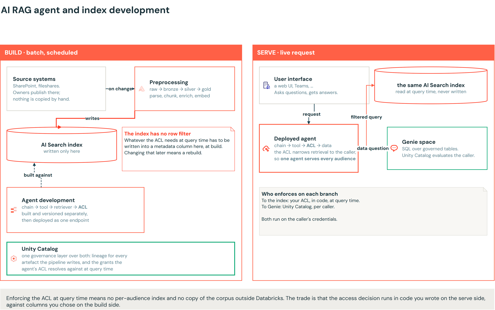
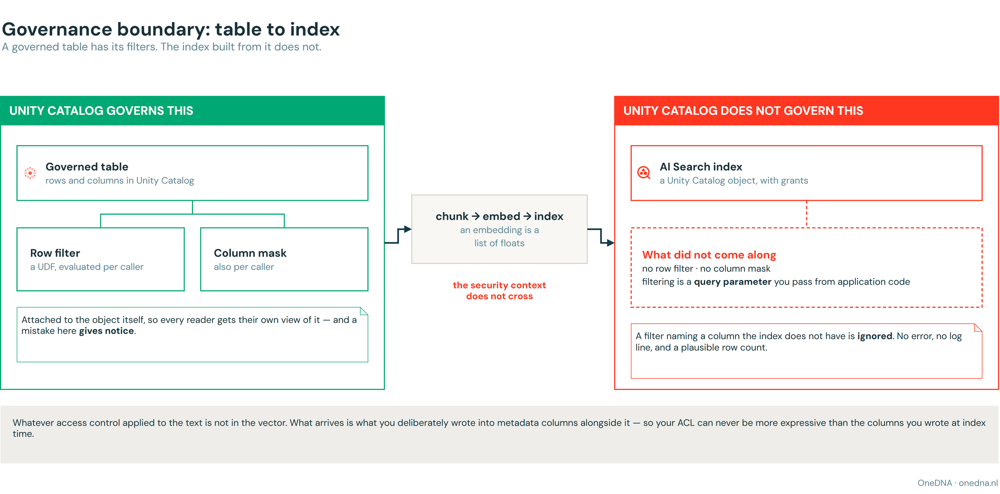
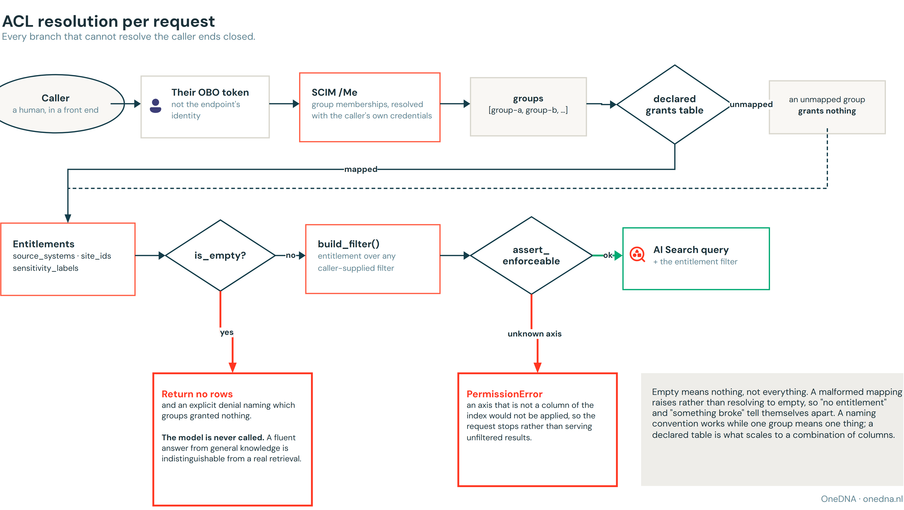
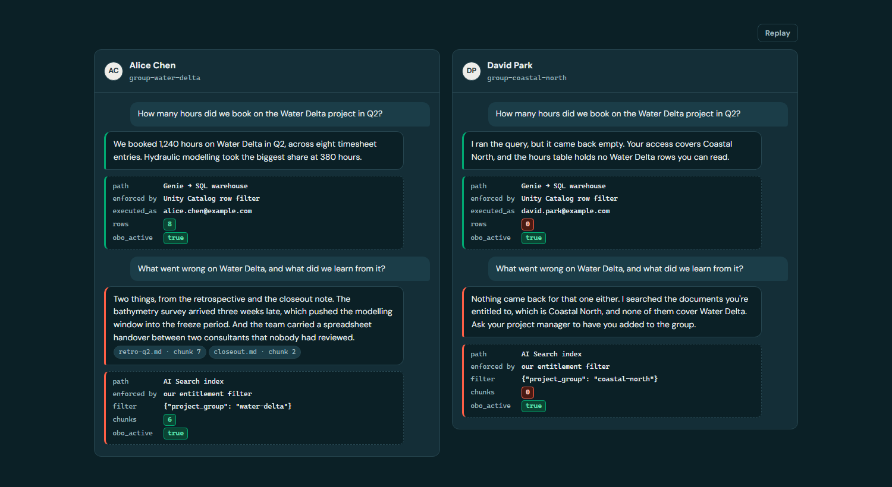
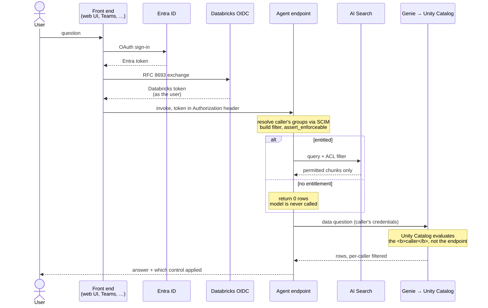
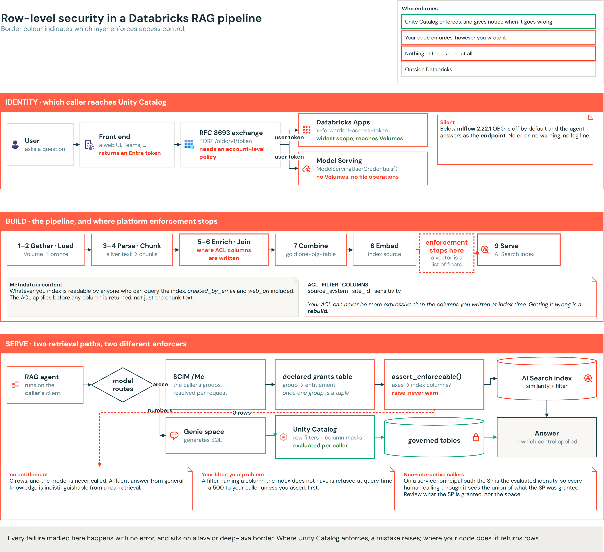
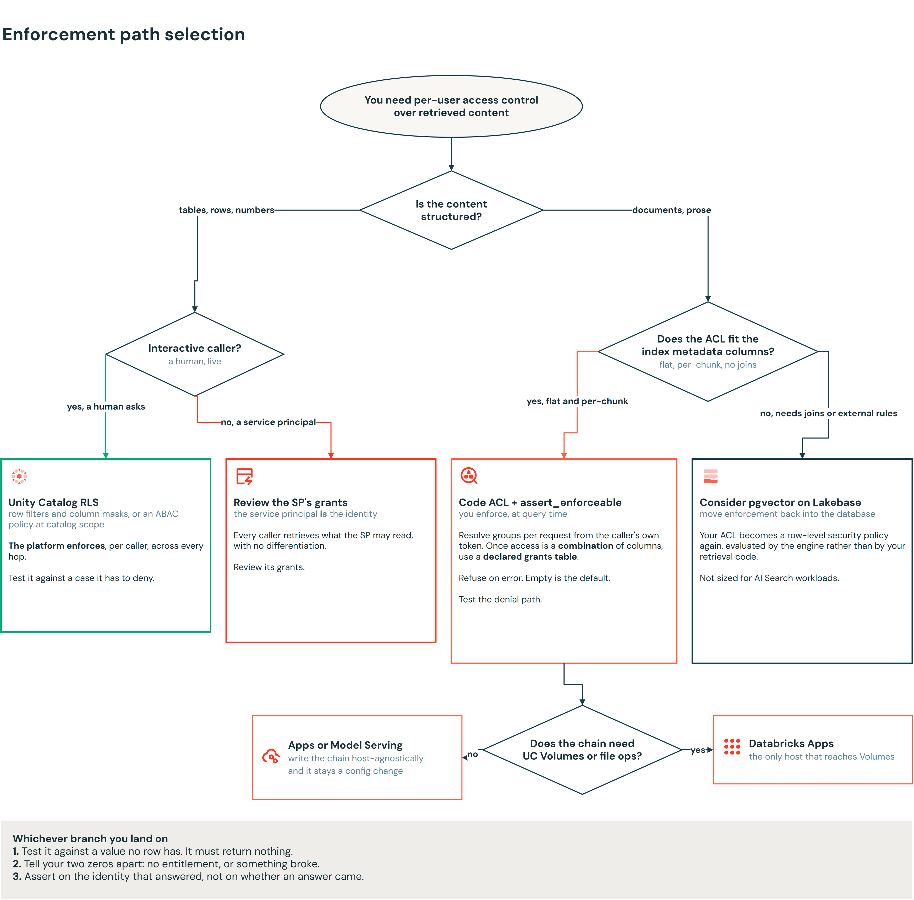

# Row-level security in een Databricks RAG-agent

*Sven Relijveld, OneDNA, september 2026*

**🇬🇧 [Read this article in English](row-level-security.md)**

---

Twee collega's stellen dezelfde chatbot dezelfde vraag. Krijgen ze hetzelfde antwoord, of horen ze
een verschillend antwoord te krijgen omdat ze verschillende dingen mogen zien? Elke organisatie die
een AI-assistent op haar eigen documenten zet, loopt hier vroeg of laat tegenaan.

In onze projecten met Databricks, zoals bij [Witteveen+Bos](https://onedna.nl/witteveenbos/), zien
we deze vragen steeds vaker langskomen. Hun business draait om het maken en verkopen van
adviesrapporten, modellen en papers aan klanten, dus produceren ze binnen een project grote
hoeveelheden ongestructureerde tekst. Maar niet iedereen hoort bij alle informatie in een project
te kunnen, laat staan bij projecten buiten zijn eigen toegangsniveau.

Zo'n systeem hebben we op Databricks gebouwd: een RAG-keten over een beheerd corpus, bereikbaar
vanuit applicaties buiten Databricks — een eigen webinterface zoals OpenWebUI, of een client als
Microsoft Teams zodra Entra-tokenfederatie aanstaat — met toegangscontrole per gebruiker. RAG op de
native AI Search (voorheen Vector Search) heeft geen voorziening voor row-level security, dus
hebben we het zelf gebouwd. Het vertrekpunt was [Mastering RAG Chatbot Security: ACL and Metadata
Filtering with Mosaic AI Vector
Search](https://community.databricks.com/t5/technical-blog/mastering-rag-chatbot-security-acl-and-metadata-filtering-with/ba-p/101946),
dat chunks tagt met een metadatakolom en een bijpassende waarde als queryfilter meegeeft. Die post
geeft die waarde met de hand mee; wat wij eraan moesten toevoegen was hem uit de aanroeper
afleiden, en daar komt SCIM binnen. Hier nemen we een vereenvoudigde versie van die aanpak om te
laten zien hoe het werkt.

## AI RAG-agent en indexontwikkeling

Het AI-RAG-systeem bestaat uit twee delen: een build-deel, waar data wordt voorbereid en agents
worden ontwikkeld, en een serve-deel, waar agents en indexen worden uitgerold en aangeroepen.

Het eerste is het **build**-pad. Dat draait op een schema en is een batch-pipeline. Documenten komen
binnen vanuit SharePoint of een fileshare waar hun eigenaren ze publiceren, en de pipeline loodst ze
door de medallion-lagen: raw geland, ingelezen in een tabel, geparsed en gechunkt en verrijkt, en
daarna gecombineerd en geëmbed tot een index. Elke stap schrijft één beheerd Unity
Catalog-artefact, dus je kunt elke stap later inspecteren. De agent wordt hier ook gebouwd: de
chain, de tools, de retriever en de ACL worden apart geversioneerd en geregistreerd, en daarna als
één endpoint uitgerold.

Het tweede is het **serve**-pad. Dat is een live requestpad en het leest de index op het moment van
inferentie. Een vraag komt binnen vanuit een web-UI of een andere externe client, de uitgerolde
agent stelt vast wie het vraagt, beperkt de retrieval tot wat die persoon mag zien, haalt op uit de
index en antwoordt.



We willen rechten op querymoment afdwingen, binnen in de agent, en ze niet inbakken in wat er
geïndexeerd wordt. Dat betekent dat je geen aparte indexen nodig hebt voor verschillende
doelgroepen: één uitgerolde agent bedient elk publiek, en er staat geen kopie van het corpus buiten
Databricks. De ruil is dat de toegangsbeslissing nu plaatsvindt in code die jij hebt geschreven aan
de serve-kant, tegen metadatakolommen die je aan de build-kant hebt gekozen.

## Row-level security op tabellen

Neem de projectdata bij een bureau als hierboven: uren, budgetten, planning, allemaal in tabellen,
en elk projectteam mag alleen bij zijn eigen data. Die situatie handelt Unity Catalog goed af. Je
hangt een row filter en een column mask aan een tabel, en iedere lezer krijgt zijn eigen beeld
ervan. Het filter is een UDF die per query draait en kijkt naar wie de vraag stelt.

```sql
CREATE FUNCTION project_group_filter(project_group STRING)
RETURN is_account_group_member('group-water-delta') AND project_group = 'water-delta'
    OR is_account_group_member('group-projects-all');

ALTER TABLE project_hours SET ROW FILTER project_group_filter ON (project_group);
```

Het kijkt naar de aanroeper en niet naar de tabeleigenaar. Twee principals die dezelfde query tegen
dezelfde tabel draaien, zien iets anders: degene in de toegelaten groep krijgt alle zeven rijen met
de budgetkolom gewoon zichtbaar, en degene in geen enkele toegelaten groep krijgt niets, waarbij de
gemaskeerde kolom als `NULL` terugkomt op de rijen die hij elders wel kan bereiken.

Of het filter echt draait, kun je nagaan door de body te vervangen door
`RETURN project_group = 'NON_EXISTING_GROUP'`, een groep die geen enkele rij heeft, dus een werkend
filter geeft iedereen niets terug. Met het origineel terug komen de zeven rijen weer. Een filter dat
eraan hangt, is niet per se een filter dat draait: `DESCRIBE TABLE EXTENDED` vertelt je dát het
bestaat, het veranderen vertelt je dat het wérkt.

Losse filters aan elke tabel hangen schaalt niet goed als je dataplatform duizenden tabellen bevat.
Attribute-based access control is sinds april 2026 GA en lost dat op: je tagt de data en hangt een
policy aan een catalog of schema, waarna elk object met die tag eronder valt, inclusief tabellen die
volgende maand worden aangemaakt door iemand die niet weet dat de policy bestaat.
`MATCH COLUMNS` vindt de juiste kolom op tag in plaats van op naam, dus een tabel die hem
`team_code` noemt in plaats van `project_group` valt er nog steeds onder. Dekking hangt niet langer
af van of iemand eraan denkt.

Op een beheerde tabel stapelen vier mechanismen, en het helpt om te weten welke vraag elk ervan
beantwoordt:

| Mechanisme | De vraag die het beantwoordt |
| --- | --- |
| Object privileges | mag je deze tabel überhaupt aanraken? |
| ABAC-policy | welke regel geldt hier, op tag, over de hele catalog? |
| Row filter | welke rijen krijg jij terug? |
| Column mask | welke waarden daarin mag jij lezen? |

In de ABAC-documentatie staat één patroon dat we nu overal gebruiken. Tag standaard alles op
catalogniveau met `classification: unverified` en schrijf een policy die alles met die tag weigert.
Nieuwe tabellen zijn dan dicht tot iemand ze classificeert, in plaats van open tot iemand het
merkt. De bètafunctionaliteit van tag propagation en auto-tagging helpt je dit snel te
implementeren.

Tot hier doet het platform het werk voor je. Dan richt je een RAG-pipeline op die documenten en
verandert het beeld: ABAC beschermt *tabellen*. Tag een tabel, embed de inhoud, en de index die
daaruit komt kan de grants overnemen, maar niet de row-level security. Je moet zelf expliciet
metadatakolommen om op te filteren aan de brontabel toevoegen, en filters meegeven aan de query die
naar de index gaat.

## De index neemt de filters niet over

Een AI Search-index is een Unity Catalog-object met grants, dus je kunt bevragen toestaan of
weigeren. Er zitten geen row filters en geen column masks op. Een index filteren is een parameter
die je in de query meegeeft, vanuit applicatiecode.

Toegangscontrole verschuift van iets dat het platform afdwingt naar iets dat jouw code
implementeert. In principe is dat even sterk: het filter draait nog steeds, en de rijen komen nog
steeds afgebakend terug. In de praktijk is het zwakker, want platformhandhaving geeft een signaal
als het misgaat en applicatiecode faalt zoals jij hem toevallig geschreven hebt.

Een document gaat op weg naar de index door parsing, chunking, verrijking en embedding, en de
security-context bereikt de index niet. Wat aankomt, is wat je bewust in metadatakolommen ernaast
hebt weggeschreven, wat betekent dat je ACL nooit expressiever kan zijn dan de kolommen die je bij
het indexeren hebt meegenomen. Omdat een schemawijziging betekent dat de tabel opnieuw aangemaakt
moet worden, kun je een hoop tokens kwijt zijn aan het opnieuw indexeren van je hele corpus.

Het bijbehorende probleem is dat metadata content **is**. Als je `created_by_email` of `web_url` als
ophaalbare kolom indexeert, zijn die waarden zichtbaar voor iedereen die de index mag bevragen, of
ze de chunktekst nu mogen lezen of niet. De ACL moet toeslaan vóórdat welke kolom dan ook
terugkomt, niet alleen vóór de chunktekst. Een filter dat de tekst beschermt en de auteurslijst
lekt, heeft niets beschermd.



## Filters op AI Search

Dus schrijf je het filter zelf en geef je het mee met de query. In ons voorbeeld heeft de index
daarvoor drie metadatakolommen — `source_system`, `site_id` en `sensitivity` — en een query noemt de
waarden die de aanroeper mag zien. Die drie kolommen bestaan omdat de toegangseis ze nodig had, en
je kiest ze bij het indexeren.

Daarmee zijn ze een randvoorwaarde voor de pipeline. De waarden moeten meestal uit het bronsysteem
zelf komen, dus de build-kant moet erbij kunnen voordat de serve-kant ergens op kan filteren. Bij
Witteveen+Bos haalden we de SharePoint-metadata als aparte stap over de Graph API op en joinden die
later op de chunks. De Databricks SharePoint-connector stelt inmiddels
`_sharepoint_metadata` direct beschikbaar, waarmee die join verdwijnt. Dat vereist DBR 18 LTS, en op
oudere versies slaagt de read nog steeds, maar zonder metadatavelden.

Tegen een live index gaf een filter op een echte kolom met een echte waarde rijen terug, en
dezelfde query met een waarde die nergens op matcht nul. Die tweede query bewijst dat het predicaat
wordt toegepast.

Voordat er een query de deur uit gaat, toetsen we de keys van het filter tegen de kolommen die de
index daadwerkelijk heeft:

```python
def assert_enforceable(filters: dict[str, Any]) -> None:
    """Weiger een filter dat de index niet daadwerkelijk kan toepassen."""
    unenforceable = sorted(set(filters) - set(ACL_FILTER_COLUMNS))
    if unenforceable:
        raise PermissionError(
            f"entitlement axes {unenforceable} are not columns of the index source "
            f"{list(ACL_FILTER_COLUMNS)}, so filtering on them would not be applied. "
            "Add the column to INDEX_BASE_COLUMNS (a rebuild) or stop emitting the predicate; "
            "serving unfiltered results is not an option."
        )
```

Hij gooit een error in plaats van een waarschuwing, en hij zit in de ACL-laag en niet in de
retriever zodat elke backend hem erft. Beide backends wijzen een onbekende kolom vandaag zelf af,
maar een regel die maar op één backend geldt, of maar op het gedrag van één maand, is niet echt een
regel.

> [!WARNING]
> **Een filter dat een kolom noemt die de index niet heeft, weigert de query.** Een typefout komt
> terug als harde fout:
>
> ```
> BadRequest: Columns referenced in filters are not present in index: sensitivty
> ```
>
> Het predicaat wordt geweigerd in plaats van weggelaten: het platform toetst filtersleutels tegen
> het indexcontract, precies wat de guard hierboven met de hand doet. Wat jouw index doet, kun je
> nagaan door hem te bevragen met een filter op een kolom die niet bestaat, en te kijken of je rijen,
> nul rijen of een error terugkrijgt.

## De ACL bouwen: vier beslissingen

Als het platform het niet afdwingt, moet de applicatie dat doen. Dat klinkt als weinig code, en dat
is het ook: de ACL wordt per request opgelost uit het token van de aanroeper zelf, de groepen komen
uit SCIM met zijn credentials zodat niemand een lidmaatschap kan claimen dat hij niet heeft, en het
resultaat wordt expliciet meegegeven aan elke retrieval in plaats van ergens uit de omgeving te
worden opgepikt. Een veertig regels, misschien.

De groepen komen uit één call, met het token van de aanroeper zelf in de header:

```python
def groups_for(token: str) -> list[str]:
    """Vraag Databricks wie de aanroeper is, als de aanroeper."""
    req = urllib.request.Request(
        f"{WORKSPACE}/api/2.0/preview/scim/v2/Me",
        headers={"Authorization": f"Bearer {token}"},
    )
    with urllib.request.urlopen(req, timeout=30) as resp:
        body = json.loads(resp.read())
    return [g["display"] for g in body.get("groups", [])]
```

We gebruiken het token van de aanroeper in plaats van dat van het endpoint, zodat niemand een
lidmaatschap kan claimen dat hij niet heeft, omdat hij niet degene is die de vraag beantwoordt. Een
401 is hier een routinegebeurtenis — een verlopen token — dus wat deze functie bij een fout doet,
bepaalt wat een fout verleent. Wij geven niets terug.

> [!NOTE]
> `/Me` geeft directe lidmaatschappen terug. Een workspace-lokale groep kan een Entra-groep als lid
> hebben, dus iemand kan transitief lid zijn van een groep die deze call niet noemt, en hem uit de
> buitenste groep halen degradeert hem niet.

Vier beslissingen in die laag bepaalden de rest:

- **Leeg betekent niets, niet alles.** Een aanroeper zonder gemapte groepen haalt niets op, en een
  deployment waar nog niemand de mapping heeft ingevuld serveert niets aan iedereen. Leeg is de
  default, en het is een echte default en geen placeholder.
- **Een kapotte configuratie gooit een error.** Een mapping die niet parseert stopt het request in
  plaats van uit te komen op een leeg recht, zodat de twee toestanden van elkaar te onderscheiden
  zijn op het moment dat ze optreden.
- **Een aanroeper zonder rechten bereikt de aanroep naar de index nooit.** Hij krijgt een expliciete
  weigering die vertelt welke van zijn groepen niets verleenden, in plaats van een antwoord uit de
  algemene kennis van het model.
- **Waar rechten uit komen is een schaalbeslissing.** Een naamconventie werkt, en het is wat we bij
  Witteveen+Bos hebben opgeleverd: de groepsnaam bevat het recht, waarvoor je niets hoeft te
  configureren. Dat houdt stand zolang één groep op één ding mapt. Zodra de toegang van een
  aanroeper een combinatie van metadatakolommen is — bijvoorbeeld een bronsysteem *én* een site *én*
  een gevoeligheid — moet de naam een tuple coderen, en is een gedeclareerde tabel nodig. Dan
  verleent een niet-gemapte groep niets, en is een bronsysteem toevoegen een
  reviewbare wijziging in een configuratiewaarde.



> [!WARNING]
> Van elk van die vier bestaat een alternatief dat toegang geeft in plaats van weigert.
>
> - **Een permissieve default** serveert het hele corpus zodra iemand de variabele vergeet.
> - **Een kapotte mapping die naar leeg degradeert** heeft hetzelfde symptoom als een terecht lege.
> - **Antwoorden uit algemene kennis** leest precies als een geslaagde retrieval.
> - **Een groepsnaam los interpreteren** geeft toegang weg aan iedereen die een groep mag aanmaken.

Die laatste is niet hypothetisch. Tegen echte workspace-groepen maakte een regel die een recht
uitlas uit elke groep waarvan de naam een bekend woord bevatte, van een beheergroep een claim op een
bronsysteem. Een naamconventie is een prima mechanisme, maar het moet een exacte match zijn
op namen die alleen jouw identiteitsproces kan uitgeven — nooit een substring-test.

De array-overlap-aanpak hierachter hebben wij niet bedacht. We hebben zo'n ACL per chunk eerder
gebouwd, in het Gen AI-framework dat we samen met het AI Nexus-team van
[Witteveen+Bos](https://onedna.nl/witteveenbos/) hebben opgeleverd, waar ongestructureerde
projectdocumenten vanuit SharePoint een beheerde index in stromen en elke chunk de groepen meedraagt
die hem mogen zien. Het een tweede keer bouwen is wat een verzameling losse beslissingen tot de vier
hierboven maakte.

Uit dat werk houden we ook twee gewoontes over. Merge het rechtenfilter van de aanroeper óver
eventuele door hem meegegeven filters heen en niet eronder, en verpak een meegegeven boolean in een
`and`. Anders kan een aanroeper zijn eigen ACL oprekken door een filter mee te sturen, en het happy
path ziet er in beide gevallen identiek uit. Houd het token ook in de `Authorization`-header in
plaats van in de request body, zodat niets dat payloads logt het kan vastleggen, inference tables
inbegrepen.

Dan is er nog wat je foutpaden verlenen. Een rechten-resolver moet een vraag beantwoorden die de
meeste code nooit krijgt: wat gebeurt er als we niet kunnen vaststellen wie je bent? Een 401 van
SCIM, een verlopen token, een hikje in het netwerk zijn hier allemaal routine, en elk daarvan
heeft een antwoord nodig.

```python
except Exception:
    return ["open access"]     # een routinefout verbreedt de toegang
```
```python
except Exception:
    return Entitlements.nobody(principal)   # een routinefout neemt hem weg
```

Allebei één regel en allebei zouden ze een review doorkomen. Bij de eerste hangt veiligheid
ervan af dat geen enkel document die sentinel-string ooit in zijn ACL-kolom heeft, en dat is een
afspraak die door niets wordt afgedwongen en die één hernoeming verwijderd is van falen. Wij
weigeren in plaats daarvan.

### Hoort de ACL een Unity Catalog-functie te zijn?

Als Unity Catalog het ding is dat beheert, is de logische vraag of deze logica daar niet in hoort
als geregistreerde functie, in plaats van in de Python van de agent. Het blijkt niet te kunnen.

Een Python-UDF die in Unity Catalog is geregistreerd, kan geen uitgaande netwerkverzoeken doen. Op
een serverless SQL warehouse is de documentatie expliciet: een query die het toch probeert, **blijft
oneindig hangen** in plaats van te falen. Onze ACL zoekt groepslidmaatschap op via SCIM, dus de
identiteitshelft kan hoe dan ook niet naar een functie verhuizen zonder een preview-netwerkfeature,
een batch-UDF en een service credential. Een request dat eeuwig hangt, is een ergere fout dan een
request dat een error geeft.

De filterhelft zou wél kunnen verhuizen, en hoort dat nog steeds niet te doen. Een Unity
Catalog-functie wordt niet door de index afgedwongen: de agent moet hem aanroepen en het resultaat
daarna zelf toepassen, precies zoals hij nu doet. Je koopt er indirectie mee, geen handhaving — en
je betaalt een round-trip per request, moeilijkere unit tests, en een functieversie die je in stap
moet houden met een agentversie. Databricks documenteert de applicatieroute als de bedoelde route:
row- en column-level permissies worden op een index niet ondersteund, en je implementeert je eigen
ACL op applicatieniveau met de filter-API.

> [!WARNING]
> **`is_account_group_member()` in een functiebody evalueert niet per se de persoon die je denkt.**
> Statements daar draaien met de rechten van de **eigenaar** en de functie kijkt naar de
> **sessie**gebruiker, dus op elk pad dat terugvalt op de credentials van het endpoint wordt het de
> service principal.

De documentatie beschrijft het gedrag van die functie onder model serving on-behalf-of helemaal
niet, dus wij beschouwen het bepalen van de aanroeper daar als onbevestigd in plaats van
gegarandeerd. Dezelfde redenering sluit uit dat je de ACL als agent-tool aanbiedt: een tool is iets
dat het model kiest om aan te roepen, en dit moet bij elk request draaien, vóór de retrieval.

### Is de rechtenmapping een eigen beheerde tabel?

De vier beslissingen hierboven zetten rechten in een gedeclareerde mapping, en in onze build is die
mapping een configuratiewaarde — en daarom betekent "een bronsysteem toevoegen is een reviewbare
wijziging" een pull request. Een Unity Catalog-tabel is er een betere plek voor, met één voorwaarde
die het hele ontwerp bepaalt.

Als tabel krijgt hij wat een configuratiewaarde niet kan hebben: `MODIFY` dat los van het
deploy-pad wordt vergeven, Delta-historie die antwoordt wie welk recht wanneer heeft gewijzigd,
lineage, en auditgebeurtenissen in `system.access.audit`. Autorisatiedata is precies het soort data
waarover je later vragen moet kunnen beantwoorden.

De voorwaarde is welke identiteit hem leest. Lees je de mapping onder het token van de aanroeper,
dan heeft die aanroeper `SELECT` nodig — en dan kan iedere gebruiker de rechten van elke groep
uitlezen, wat een onthulling over het veiligheidsmodel zelf is en strikt slechter dan de
configuratiewaarde die het vervangt. Het requestpad gebruikt dus bewust twee identiteiten: het token
van de aanroeper bepaalt het groepslidmaatschap van die aanroeper, en de service principal van het
endpoint leest de mapping. Cache hem in het proces met een begrensde verversing, en bepaal wat er
gebeurt als de read faalt, want de ACL hangt nu af van een datapad dat overeind staat voordat hij
iets kan autoriseren. Weiger ook daar.

> [!NOTE]
> Grijp niet naar een row filter op de mapping-tabel om het onthullingsprobleem op te lossen. Time
> travel en cloning falen op een tabel met een actieve ABAC-policy, dus dan geef je juist de
> audithistorie weg die de tabel in de eerste plaats rechtvaardigde.
>
> Deze is een ontwerpconclusie en geen meting. Al het andere in dit artikel hebben we gedraaid; de
> mapping in onze build is nog steeds de configuratiewaarde.

## On-behalf-of: welke identiteit Unity Catalog bereikt

Dat alles gaat ervan uit dat de agent weet wie het vraagt, en dat is het waard om te controleren.
De agent draait ergens — een serving endpoint, een app, een container — en dat ding heeft een eigen
identiteit. Wat je wilt, is dat de identiteit van de aanroeper Unity Catalog bereikt, en niet die
van de deployer.

On-behalf-of doet dat. Twee losse dingen bepalen of het werkt: welke host de keten draait, en hoe
het token van de aanroeper binnenkomt.

Twee hosts kunnen hem draaien, en één verschil bepaalt welke:

| | Databricks Apps | Model Serving |
| --- | --- | --- |
| Token komt binnen als | `x-forwarded-access-token`-header | in handen van de serving runtime |
| Code haalt het op via | de header lezen | `ModelServingUserCredentials()` |
| Bereikt | de breedste scope, inclusief UC Volumes | index, warehouses, tabellen, Genie — **geen** Volumes |

Zodra de keten een bestand aanraakt, moet Apps de host zijn. Schrijf de keten zo dat hij niet weet
op welke host hij draait en het blijft een configuratiewijziging.

Ze stapelen ook. Een App kan een serving endpoint als resource aanroepen en het token van de
aanroeper doorgeven, zodat het endpoint nog steeds als die gebruiker draait. Zo krijg je een UI op
Apps met de keten als model geversioneerd.

Vóór beide hosts staat wat de gebruiker opent: een eigen web-UI, iets als Microsoft Teams, elke
client die geen Databricks is. Geen ervan kan een Databricks-token vasthouden, dus ze hebben alle
hetzelfde nodig — **Entra-tokenfederatie**.

De gebruiker aanmelden met Entra levert een Entra-token op, dat Databricks op workspace-API's
weigert. De front end wisselt het in bij `/oidc/v1/token` (RFC 8693) en roept het endpoint aan met
het resultaat. Die exchange aanzetten is configuratie op account- en tenantniveau, geen code: een
federation policy op accountniveau die de issuer en audience vertrouwt, en een Entra
app-registratie die uitstuurt wat die policy verwacht — `preferred_username` als optionele
access-token-claim, `requestedAccessTokenVersion` 2, en een scope die de front end namens de
gebruiker kan opvragen. Staat dat goed, dan heeft de front end een gewoon
Databricks-gebruikerstoken.

Elke hop geeft één token door, en laat de identiteit vallen als hij dat niet doet:

| Hop | Geeft door | Wat er gebeurt als dit niet werkt |
| --- | --- | --- |
| Gebruiker → front end | de aanmelding, via Entra | niemand is geauthenticeerd |
| Front end → Databricks | Entra-token **ingewisseld** voor een Databricks-token | de workspace-API weigert het |
| Front end → host | dat token in de `Authorization`-header | de host antwoordt als zichzelf |
| App → serving endpoint | hetzelfde token doorgegeven | het endpoint antwoordt als de App |
| Host → index, Genie, tabellen | de credentials van de aanroeper | Unity Catalog evalueert de verkeerde identiteit |

Voor de versies: `mlflow` op 2.22.1 of hoger, en `databricks-ai-bridge` aanwezig in de *gelogde*
requirements en niet alleen in de omgeving. We asserten bij registratie ook dat de index bestaat én
rijen bevat voordat er iets wordt geregistreerd, want een bundle in development-mode zet een prefix
voor het schema dat hij aanmaakt en de agent kan zich anders in `dev_<gebruiker>_schema`
registreren terwijl de gevulde index in het gedeelde schema staat.

> [!WARNING]
> **Elke voorwaarde in deze paragraaf faalt zonder foutmelding.** Onder `mlflow` 2.22.1 staat OBO
> standaard uit; een ontbrekende `databricks-ai-bridge` laat de agent terugvallen op zijn eigen
> identiteit; elk van de Entra-instellingen breekt de exchange met een fout die iets anders
> noemt.

Retrieval die naar het verkeerde schema wijst geeft ook nul rijen, wat er precies zo uitziet als een
terecht geweigerde aanroeper. Assert dus op de identiteit die het antwoord heeft opgeleverd en niet
op de vraag of er een antwoord kwam — een test die op een response controleert, slaagt even goed of
elke aanroeper nu zijn eigen rechten krijgt of die van de deployer.

## Het filter meten

Hoe retrieval per gebruiker er van buiten uitziet: twee collega's op verschillende projecten,
dezelfde agent, dezelfde twee vragen. De ene vraag is kwantitatief en gaat naar Genie, waar Unity
Catalog handhaaft. De andere is kwalitatief en gaat naar de index, waar ons eigen filter dat doet.



Beide antwoorden van David zijn leeg, en hoewel de antwoorden er hetzelfde uitzien, verschillen ze
licht in mechanisme. Op het Genie-pad heeft het platform beslist. Op het indexpad heeft ons filter
beslist — en hadden we helemaal geen filter meegegeven, dan had hij Water Delta-chunks gekregen
zonder error en zonder waarschuwing. `obo_active` staat in alle vier de metadataboxen op `true`, en
dat is wat beide nullen leesbaar maakt.

Dezelfde controle kun je tegen je eigen gedeployde endpoint draaien: dezelfde gebruiker, dezelfde
vraag, dezelfde geregistreerde modelversie, met de groep-naar-recht-mapping als enige variabele.
Gemapt op de echte groep van de aanroeper gaf retrieval vijf rijen en een onderbouwd antwoord met
verwijzing naar het corpus. Gemapt op een groep waar niemand in zit, gaf het nul rijen en een
uitgelegde weigering, en werd het model nooit aangeroepen.

`obo_active` rapporteerde in beide runs `True`, en dat isoleert het rechtenfilter van de
identiteitsplumbing: de aanroeper werd in beide gevallen correct herkend en alleen zijn recht
veranderde. Zonder die vlag kan een nul "correct geweigerd" of "identiteit stuk" betekenen, zonder
manier om te zien welke van de twee.

De run met rechten leerde ons ook iets waar we niet op testten. Op de vraag wat het corpus over een
bepaald ontwerpvraagstuk besluit, antwoordde de agent dat de documenten daar geen besluit over
nemen en noemde hij de vraag onbeslist, in plaats van een besluit te verzinnen. Dat is alleen te
controleren tegen een echt corpus met echte gaten erin, want synthetische testdata beantwoordt elke
vraag die je bij het maken hebt bedacht.



De agent rapporteert welke handhaving elk antwoord heeft opgeleverd, de groepsgrant of Unity
Catalog, zodat een citatie te herleiden is tot het recht dat hem toeliet.

## Genie als tweede retrieval-pad

Niet elke vraag is een documentvraag. Vraag hoeveel uren er per projectgroep zijn geboekt en een
similarity search over proza geeft passages terug, en geen enkel aantal passages telt op tot een
totaal. Daarom heeft de agent een tweede retrieval-pad, waar het platform het handhaven weer
overneemt, en kiest het model ertussen. Vragen over besluiten en onderbouwing gaan naar similarity
search over proza; vragen over aantallen en totalen gaan naar een Genie-space, die SQL genereert
tegen beheerde tabellen. Beide draaien op de credentials van de aanroeper, dus het
identiteitsverhaal is op beide takken hetzelfde en het model kan zich geen weg banen naar een
bevoorrecht pad. Wat verschilt, is wie handhaaft. Op de prozatak is dat onze gedeclareerde
grants-tabel, en de reden dat je een passage krijgt is daar "een van jouw groepen liet hem toe". Op
de datatak is het Unity Catalog zelf, en de reden is "Unity Catalog heeft jou gecontroleerd", met de
gegenereerde SQL en een statement-id als bewijs.

De identiteit van de aanroeper houdt stand over de hops naar Genie, op elk pad dat we konden
bouwen. Query history schrijft het statement toe aan de mens op het
interactieve pad, via de agent onder OBO, en vanuit een externe front end — dat een derde hop
toevoegt via Entra en de token-exchange. In alle gevallen noemt `executed_as_user_name` de persoon,
niet de service principal van het serving endpoint.

Beide takken, en het identiteitswerk ervoor, op één pagina — lees hem eerst op randkleur, daarna
pas op pijlen:



Een service principal die dezelfde space via de API aanroept, krijgt zijn eigen identiteit
geëvalueerd, eerlijk, als zichzelf. Er worden geen rechten witgewassen. Onder user authorization
gelden de grants van de aanroeper zelf en heeft het endpoint geen eigen staande grant nodig, dus
declareert `SystemAuthPolicy` alleen het chatmodel en regelt `UserAuthPolicy` de rest.

> [!WARNING]
> **Op een niet-interactief pad haalt iedere aanroeper op wat de service principal mag lezen.** Iedere
> mens die via die integratie belt, ziet de vereniging van waar hij recht op heeft, zonder enige
> differentiatie. Een review van dit pad moet dus de grants van die service principal nagaan.

Er is een configuratieroute naar hetzelfde punt. Databricks documenteert dat een SP toegang geven
tot een Genie-space ook vereist dat je de onderliggende tabellen en warehouse verleent. Volg die
richtlijn voor een agent en het endpoint houdt een staande grant op de data, dus ziet iedere
aanroeper de vereniging van wat het endpoint mag lezen. Onder user authorization heb je die grants
niet nodig; voeg ze niet toe.

Welke tabellen je aan een Genie-space toevoegt is ook geen security-control. We vroegen vier keer,
met twee identiteiten, om een tabel die we er expres niet aan hadden toegevoegd, en Genie weigerde
elke keer en genereerde geen SQL. Dat lijkt op handhaving, maar het is het model dat een tabel niet
noemt die het nooit heeft gezien, en een modelupdate kan dat veranderen zonder release note.
Databricks documenteert het niet als grens op wat Genie kan bereiken. Vertrouw in plaats daarvan op
Unity Catalog-grants.

## Platformfeatures in preview

Twee Unity Catalog-previews mikken op het service-principalprobleem en op het schrijven van één
policy per groep. Beide zijn Beta, en een account-admin moet ze aanzetten.

Identity attributes laten een policy de attributen van de aanroeper rechtstreeks lezen in plaats van
via groepslidmaatschap. Account-SCIM provisioneert `title`, `department` en `costCenter` vanuit je
identity provider, en een policy kan de afdeling van de aanroeper vergelijken met een tag op de
tabel, wat één policy per afdeling terugbrengt tot één policy. De polariteit van de conditie vraagt
aandacht. De identity-functies geven `false` terug zowel wanneer de gebruiker geen waarde voor het
attribuut heeft als wanneer de sleutel niet bestaat, dus de conditie moet zó geschreven zijn dat
`false` beperkt. Andersom geschreven ziet elke gebruiker die je SCIM-sync niet heeft gevuld de data
ongemaskeerd, en wordt een gat in je provisioning een toegangsrecht.

Context attributes mikken recht op het service-principal-probleem. Ze maken het aanvraagpad zelf
tot input voor een policy, zodat een directe query echte waarden kan geven terwijl een agent die
namens diezelfde gebruiker handelt een masker ziet. Je kunt matchen op een specifiek geregistreerde
OAuth-applicatie, waarmee "een agent mag minder zien dan de mens namens wie hij handelt"
uitdrukbaar wordt op het platform in plaats van gebouwd in de keten.

> [!NOTE]
> **Beide features zijn Beta, en context attributes dekken niet elk pad.** De documentatie is
> expliciet dat Genie `request.is_on_behalf_of` niet zet, dus de Genie-route valt buiten de policy.

Een personal access token zet hem ook niet, en de ingebouwde `databricks-cli` client-id is gedeeld,
dus een agent die hem gebruikt is niet te onderscheiden van een mens achter een terminal. Registreer
je eigen OAuth-applicatie als je een specifieke wilt governen.

> [!NOTE]
> **Er is een derde optie, en die is vandaag al beschikbaar in plaats van Beta.** Serveer de
> vectoren uit pgvector op Lakebase in plaats van uit AI Search, en de ACL wordt weer een
> row-level security-policy die de database evalueert, dus past Postgres het filter toe in plaats
> van jouw retrievalcode. Voor ons is dat een governance-argument en geen
> latency-argument.
>
> Het is geen een-op-een-vervanging. Een storage-optimized AI Search-endpoint is gedocumenteerd tot
> een miljard embeddings; pgvector op Lakebase is daar niet op berekend.
>
> Diezelfde klasse fouten verdwijnt er niet mee. Ons `sensitivity`-filter noemde een kolom die geen
> enkele stap ooit produceerde, en op pgvector is dat een harde "kolom bestaat niet". Beide
> backends weigeren het vandaag, en het filter is op beide even kapot. AI Search kwam daar door te
> bewegen, de veilige kant op, zonder het te
> melden. Dat is het argument om de check zelf te bezitten, geen bewijs dat je ermee kunt stoppen.

## Aanbevelingen

**Begrijp waar toegangscontrole moet worden afgedwongen, en wie daarvan is.** Een beheerde tabel
wordt door het platform afgedwongen; een vectorindex door wie de retrievalcode schrijft. Dat splitst
het werk tussen de indexbouwer, die de ACL-kolommen erin moet zetten, en de agentontwikkelaar, die
erop moet filteren.

**Schrijf de ACL-kolommen weg bij het indexeren.** Je ACL kan nooit expressiever zijn dan de
metadata die je naast de chunks hebt weggeschreven, en er later een toevoegen betekent een rebuild.

**Maak je faalmodi expliciet.** "Geen recht" en "verlopen token" zijn verschillende gebeurtenissen
die beide nul rijen opleveren. Geef elk een eigen signaal, zodat je aan het antwoord kunt zien met
welke van de twee je te maken hebt.

**Controleer de toegangsrechten op je achterliggende paden.** Op elk niet-interactief pad haalt
iedere aanroeper op wat de service principal mag lezen, wat er ook aan row-level security aanstaat.

Welk pad je krijgt volgt uit twee vragen — of de content gestructureerd is, en of je ACL past op de
kolommen die je mee de index in kunt nemen:



Test daarna elke control tegen een geval waarin hij moet weigeren. Richt het filter op een waarde
die geen enkele rij heeft en controleer of het niets oplevert. Trek de grant in en controleer of
het antwoord verdwijnt. Zet de groep op eentje waar niemand in zit en controleer of het rijaantal
naar nul gaat. Een control die je alleen hebt zien slagen, is een control die je niet hebt getest.

## Zelf uitproberen

Je kunt dit zelf uitproberen via de [demo-repo](https://github.com/OneDNA/blog-databricks-rag-rls).
Daarin staat een uitvoerbare demonstratie van elke fout die hierboven staat — het filter dat een
kolom noemt die de index niet heeft, de guard die dat weigert, SCIM-groepen die naar rechten worden
opgelost, de credential providers naast elkaar, het contrast met de beheerde tabel, en een
reproduceerbare row-filter-fixture met zijn negatieve gevallen — plus de diagrammen als bewerkbare
draw.io-bronbestanden.

## Tot slot

Row-level security over een RAG-agent is een reeks kleine ontwerpbeslissingen die samen moeten
werken, geen feature die je aanzet. Unity Catalog evalueert per aanroeper en OBO brengt de
identiteit door drie hops heen, maar wéten hoe je wilt dat het systeem zich gedraagt is het
makkelijke deel — het zich zo laten gedragen, en merken wanneer dat niet zo is, is het werk. Teken
uit wat je bij elke stap verwacht, en bouw de checks die elk van deze fouten zouden vangen in je
testcyclus.

## Benieuwd hoe andere teams toegangscontrole op AI-toepassingen aanpakken?

We gaan graag in gesprek over ervaringen, best practices en lessen uit de praktijk van RAG, Unity
Catalog en per-gebruiker toegangscontrole op Databricks. Neem contact op via
[onedna.nl](https://onedna.nl) of [LinkedIn](https://nl.linkedin.com/company/one-dna).

---

<sub>Geschreven door Sven Relijveld bij [OneDNA](https://onedna.nl). Kennisdelen zit in ons DNA.
Identifiers en groepsnamen zijn voor publicatie gegeneraliseerd.</sub>
